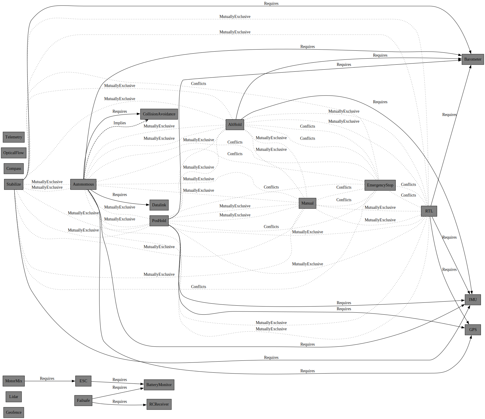

# fatp-drone · FeatureManager

A dependency-resolving feature flag system built on [FAT-P](https://github.com/schroedermatthew/FatP).

The premise: feature flags in real systems are not booleans. They have dependencies, implications, conflicts, and safety constraints. Tracking all of that by hand — checking whether enabling GPU rendering also enables the shader compiler, whether HDR conflicts with the old display mode, whether toggling a subsystem OFF would orphan everything that depended on it — is how you get bugs. FeatureManager makes it automatic, validated, and transactional.

Five relationship types. Transitive dependency resolution. Cycle detection with path reporting. Observer pattern with RAII lifetime management. JSON round-trip serialization. GraphViz DOT export. Pluggable thread-safety policy. And a `Preempts` relationship built specifically for e-stop and override scenarios — enabling the source forcibly disables the target, cascades through its reverse-dependency closure, and latches inhibit so nothing can sneak back on.

This component was built by an AI pair-programmer. The FAT-P development guidelines — covering code standards, naming conventions, test structure, benchmark methodology, CI workflow, documentation style, and AI operational behavior — were transferred from the parent library and edited to fit this project. The AI works from those adapted guidelines and produces code and tests to that standard from the start, rather than having a human retrofit compliance afterward. FeatureManager is the result: 2,662 lines of production C++20, 44 passing tests, full JSON serialization, and a drone demo that exercises the complete feature graph under realistic safety constraints.

[](https://github.com/schroedermatthew/fatp-drone/actions/workflows/fatp-drone.yml)

---

## Relationships

| Type | Semantics | Symmetric? |
|---|---|---|
| `Requires` | Enabling A auto-enables B. Disabling B blocked while A is on. | No |
| `Implies` | Enabling A auto-enables B (softer than Requires). | No |
| `Conflicts` | A and B cannot both be enabled. | Yes (auto) |
| `MutuallyExclusive` | Group constraint — only one member can be enabled at a time. | Yes (auto) |
| `Preempts` | Enabling A force-disables B and its entire reverse-dependency closure. Latches inhibit: B cannot re-enable while A is on. | No |

---

## Demo: fatp-drone

The included drone demo shows FeatureManager driving a real control-systems problem — 22 subsystems with hard safety constraints, live state enforcement, and a full vehicle lifecycle state machine.

The key point: **every dependency and constraint is declared explicitly in code, once.** There is no implicit knowledge scattered across enable/disable call sites. The graph is the source of truth; FeatureManager enforces it everywhere.

### Try it live — WebAssembly simulator

The drone demo compiles to WebAssembly and runs entirely in the browser. No server, no install — the same C++ binary that passes the CI test suite, served as a single HTML file.

**[→ Open the live simulator](https://schroedermatthew.github.io/fatp-drone/)**

The simulator exposes the full `CommandParser::execute()` interface with a GUI that explains the system's rules as you interact with them:

- **Self-explaining failures** — when ARM fails, the missing subsystems pulse red in the left panel and a checklist shows exactly which of the 6 requirements are unmet.
- **Guard previews** — hover any action button to see exactly what's missing or confirm it's ready, before you click.
- **Dependency cascade** — enabling a subsystem that unlocks others via `Requires`/`Implies` edges triggers a purple cascade animation on the newly-reachable nodes and edges in the live graph.
- **Typed telemetry log** — log delta lines are parsed into typed entries (✓ enabled, ○ disabled, ◈ state change, ⚠ safety, ✗ error) with per-type color coding.
- **Live state machine** — transition arrows turn green (reachable) or red (blocked) in real time based on current state and subsystem conditions.
- **Timeline strip** — a scrubable event bar accumulates every enable/disable/state/safety event as a colored pip. Hover any pip to see the label.
- **Quick-arm shortcuts** — one-click "Enable All Arm Requirements" button, and flight mode picker chips for instant mode switching.

The WASM binary is built from the same source as the CLI demo using `clang-18 --target=wasm32-wasi`. A thin JS bridge exposes `execute_command_json`, `get_state_name`, and the FeatureManager JSON export. No Emscripten runtime — just a 1.1 MB `.wasm` file instantiated directly via `WebAssembly.instantiate`.

To build and embed:

```bash
# Build WASM (requires clang-18 + wasi-sysroot)
./build.sh

# Embed binary into the HTML template
python embed_wasm.py fatp-drone.wasm fatp-drone-wasm-template.html fatp-drone-latest.html
```

### The graph in code

```cpp
void registerRelationships()
{
    using namespace drone::subsystems;
    using FR = fat_p::feature::FeatureRelationship;

    // Power chain
    requireOk(mManager.addRelationship(kESC,      FR::Requires, kBatteryMonitor), "ESC->BatteryMonitor");
    requireOk(mManager.addRelationship(kMotorMix, FR::Requires, kESC),            "MotorMix->ESC");

    // Safety
    requireOk(mManager.addRelationship(kFailsafe, FR::Requires, kBatteryMonitor), "Failsafe->BatteryMonitor");
    requireOk(mManager.addRelationship(kFailsafe, FR::Requires, kRCReceiver),     "Failsafe->RCReceiver");

    // Flight mode sensor requirements.
    // NOTE: Flight modes are MutuallyExclusive — they cannot chain via Requires
    // (AltHold cannot Require Stabilize since they conflict with each other).
    // Each mode independently declares the sensors it needs.

    requireOk(mManager.addRelationship(kStabilize,  FR::Requires, kIMU),       "Stabilize->IMU");
    requireOk(mManager.addRelationship(kStabilize,  FR::Requires, kBarometer), "Stabilize->Barometer");

    requireOk(mManager.addRelationship(kAltHold,    FR::Requires, kIMU),       "AltHold->IMU");
    requireOk(mManager.addRelationship(kAltHold,    FR::Requires, kBarometer), "AltHold->Barometer");

    requireOk(mManager.addRelationship(kPosHold,    FR::Requires, kIMU),       "PosHold->IMU");
    requireOk(mManager.addRelationship(kPosHold,    FR::Requires, kBarometer), "PosHold->Barometer");
    requireOk(mManager.addRelationship(kPosHold,    FR::Requires, kGPS),       "PosHold->GPS");

    requireOk(mManager.addRelationship(kAutonomous, FR::Requires, kIMU),            "Auto->IMU");
    requireOk(mManager.addRelationship(kAutonomous, FR::Requires, kBarometer),      "Auto->Barometer");
    requireOk(mManager.addRelationship(kAutonomous, FR::Requires, kGPS),            "Auto->GPS");
    requireOk(mManager.addRelationship(kAutonomous, FR::Requires, kDatalink),       "Auto->Datalink");
    requireOk(mManager.addRelationship(kAutonomous, FR::Requires, kCollisionAvoid), "Auto->CollisionAvoid");
    requireOk(mManager.addRelationship(kAutonomous, FR::Implies,  kCollisionAvoid), "Auto=>CollisionAvoid");

    requireOk(mManager.addRelationship(kRTL, FR::Requires, kIMU),       "RTL->IMU");
    requireOk(mManager.addRelationship(kRTL, FR::Requires, kBarometer), "RTL->Barometer");
    requireOk(mManager.addRelationship(kRTL, FR::Requires, kGPS),       "RTL->GPS");

    // EmergencyStop preempts all flight modes — force-disables the active mode
    // and latches inhibit so no flight mode can re-enable while it is active.
    for (const char* mode : {kManual, kStabilize, kAltHold, kPosHold, kAutonomous, kRTL})
    {
        requireOk(mManager.addRelationship(kEmergencyStop, FR::Preempts, mode), "EmergencyStop preempts mode");
    }
}

void registerGroups()
{
    requireOk(mManager.addGroup(kGroupSensors,
                  {kIMU, kGPS, kBarometer, kCompass, kOpticalFlow, kLidar}), "addGroup Sensors");

    requireOk(mManager.addGroup(kGroupPower,
                  {kBatteryMonitor, kESC, kMotorMix}), "addGroup Power");

    requireOk(mManager.addGroup(kGroupComms,
                  {kRCReceiver, kTelemetry, kDatalink}), "addGroup Comms");

    // MutuallyExclusive: adds Conflicts between every pair of flight modes
    requireOk(mManager.addMutuallyExclusiveGroup(kGroupFlightModes,
                  {kManual, kStabilize, kAltHold, kPosHold, kAutonomous, kRTL}),
              "addMutuallyExclusiveGroup FlightModes");

    requireOk(mManager.addGroup(kGroupSafety,
                  {kGeofence, kFailsafe, kCollisionAvoid, kEmergencyStop}), "addGroup Safety");
}
```

### The graph rendered

Exported via `mgr.exportDependencyGraph()` → `toDot()`, rendered by Graphviz. Solid edges: Requires. Dashed: Implies. Bold red: Preempts. Dotted: MutuallyExclusive.



### What the enforcement looks like

```
> enable PosHold
  GPS enabled (auto)
  IMU enabled (auto)
  Barometer enabled (auto)
  PosHold enabled

> enable Stabilize
  Error: PosHold is mutually exclusive with Stabilize

> enable EmergencyStop
  PosHold disabled (Preempts cascade)
  GPS, IMU, Barometer disabled (reverse-dependency closure)
  EmergencyStop enabled
  Latch active: no flight mode can re-enable

> takeoff
  Error: no flight mode is active

> graph
  digraph FeatureGraph { ... }   (live export — paste into graphviz.online)

> json
  { "features": { ... } }       (save / restore full state)
```

Vehicle lifecycle: `Preflight → Armed → Flying → Landing → Armed` (or `→ Emergency → Preflight`). Every transition is guard-protected: arming checks IMU, Barometer, BatteryMonitor, ESC, MotorMix, RCReceiver; takeoff requires an active flight mode; emergency is always available.

---

## Tests

44 unit tests across logic, observer, serialization, and Preempts coverage. The drone demo adds 78 more across SubsystemManager, VehicleStateMachine, TelemetryLog, and DroneCore integration suites.

---

## How FAT-P makes this possible

FeatureManager is built from FAT-P components, each solving a specific part of the problem:

| FAT-P Component | Role in FeatureManager |
|---|---|
| **Expected** | All operation results — no exceptions in domain logic |
| **FlatSet** | Cache-friendly sorted-vector relationship storage |
| **FastHashMap** | O(1) feature lookup, desiredState planning map |
| **JsonLite** | Full graph serialization / deserialization |
| **Factory** | Callback registry for serializable validation keys |
| **ValueGuard** | Scoped state changes with automatic rollback |
| **EnumPlus** | `FeatureRelationship` enum with string round-trip for JSON |
| **ConcurrencyPolicies** | Pluggable thread-safety (SingleThreaded / Mutex / SharedMutex) |
| **Stringify** | Error message construction |

The components weren't designed for a feature manager. They were designed to be useful individually. FeatureManager is what happens when you compose them.

---

## Building

Header-only. Requires C++20 and FAT-P.

```bash
# Tests
cmake -B build -DFATP_INCLUDE_DIR=/path/to/FatP
cmake --build build --config Release
ctest --test-dir build -C Release --output-on-failure

# Header self-containment check
g++ -std=c++20 -I/path/to/FatP test_FeatureManager_HeaderSelfContained.cpp
```

### CMake options

| Option | Default | Description |
|---|---|---|
| `FATP_INCLUDE_DIR` | auto-detect | Path to FAT-P include directory |
| `FATP_FM_BUILD_TESTS` | `ON` | Build test executables |
| `FATP_FM_BUILD_BENCHMARKS` | `OFF` | Build benchmark suite |
| `FATP_FM_BUILD_DRONE_DEMO` | `ON` | Build fatp-drone demo |

---

## Performance

| Operation | Complexity | Notes |
|---|---|---|
| `isEnabled()` | O(1) | FastHashMap lookup |
| `enable()` / `disable()` | O(d × log n) | d = dependency depth |
| `validate()` | O(n × d × log n) | Full graph traversal |
| `addFeature()` | O(log n) | Map insertion |
| `addRelationship()` | O(log r) | FlatSet insertion |
| `toJson()` | O(n) | Feature iteration |
| `fromJson()` | O(n) | Parse + factory lookup |
| Memory per feature | ~574 bytes | With 5 relationships, FlatSet storage |

The plan/commit transaction model used for `enable()` means no partial state is ever visible and there is no rollback code — if planning fails, nothing was mutated.
