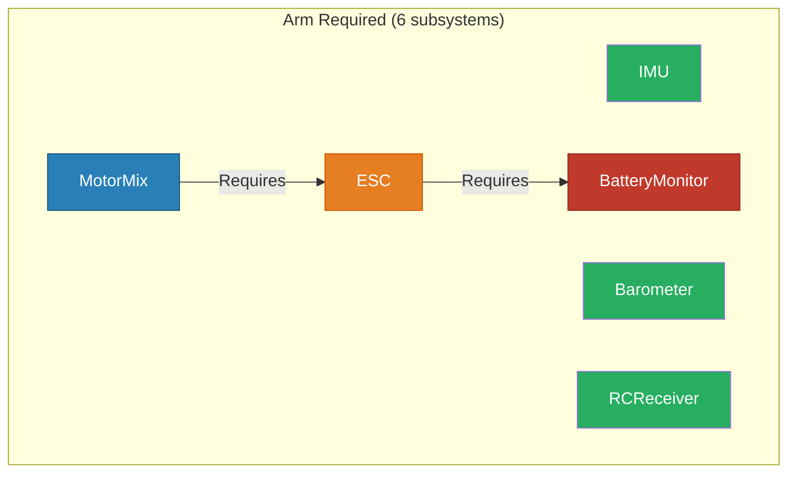
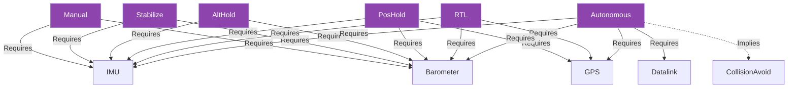

# Case Study - The Graph Is the Source of Truth
## Dependency Cascade, Test Assumption Failures, and What Declaring Safety Constraints in Code Actually Means — demonstrated with FeatureManager and fatp-drone

**Scope:** This case study examines two test failures in the fatp-drone drone demo project that revealed a deeper principle: when you declare safety constraints in the dependency graph, you must understand the graph completely before you can write a correct test. The drone demo is used as the specimen throughout — a 22-subsystem control system built on FeatureManager — but the lessons apply to any system where the graph is the specification.

**Not covered:**
- FeatureManager API (see [User Manual - FeatureManager](UM-FEATUREMANAGER-001) and [Overview - FeatureManager](OV-FEATUREMANAGER-001))
- General test methodology
- The full drone demo architecture (see the project README)
- CI/CD configuration

**Prerequisites:**
- Familiarity with FeatureManager's `Requires`, `MutuallyExclusive`, and `Preempts` relationships
- Understanding of dependency graph semantics (enabling A auto-enables B when A Requires B)
- Basic C++ test structure

---

## Case Study Card

**Problem:** Two adversarial tests failed CI across all 14 compiler/sanitizer matrix jobs  
**Constraint:** `Requires` cascade — enabling ESC auto-enables BatteryMonitor; the test was trying to test "BatteryMonitor missing" while enabling ESC, which re-introduced BatteryMonitor via cascade  
**Symptom:** `adversarial_disable_not_enabled_subsystem` and `adversarial_validate_arming_readiness_each_missing_subsystem` both reported assertion failures  
**Root cause:** Both tests made assumptions about FeatureManager behavior that contradicted the declared dependency graph  
**Fix pattern:** Interrogate the graph before writing the assertion; when the graph says cascade will occur, the test must account for it or withhold the cascading enabler  
**FAT-P components used:** FeatureManager (SubsystemManager wraps it), VehicleStateMachine, CommandParser  
**Build-mode gotchas:** None — logic failures, not UB; both Debug and Release reproduced identically  
**Guarantees:** After fix, all 40 SubsystemManager tests pass across GCC-12/13/14, Clang-16/17, MSVC C++20/23, ASAN, UBSAN, TSAN  
**Non-guarantees:** The fix does not add coverage for adversarial inputs to FeatureManager itself (that belongs in a dedicated FeatureManager test suite)

---

## Table of Contents

- [⚠️ Before You Read Further: The Cascade Trap](#before-you-read-further)
- [Part I — The Problems](#part-i--the-problems)
  - [The Obvious Approach](#the-obvious-approach)
  - [The Hidden Constraint](#the-hidden-constraint)
  - [The Symptoms](#the-symptoms)
  - [The Cost](#the-cost)
  - [Solution Preview](#solution-preview)
- [Part II — The Solutions](#part-ii--the-solutions)
  - [The Mechanism](#the-mechanism)
  - [Guarantees / Non-Guarantees](#guarantees--non-guarantees)
  - [Decision Guide](#decision-guide)
  - [Where It Loses](#where-it-loses)
- [Part III — The Case Study Story](#part-iii--the-case-study-story)
  - [Context](#context)
  - [Initial Approach](#initial-approach)
  - [Observations](#observations)
  - [Hypotheses](#hypotheses)
  - [Evidence](#evidence)
  - [The Fix](#the-fix)
  - [Results](#results)
  - [Components Used](#components-used)
  - [Transferable Lessons](#transferable-lessons)
- [Part IV — Foundations](#part-iv--foundations)
  - [Design Rationale](#design-rationale)
  - [Rejected Alternatives](#rejected-alternatives)
  - [Edge Cases](#edge-cases)
  - [Mechanical Audit Checklist](#mechanical-audit-checklist)
- [Design Rules to Internalize](#design-rules-to-internalize)
- [What To Do Now](#what-to-do-now)

---

## ⚠️ Before You Read Further: The Cascade Trap {#before-you-read-further}

```cpp
// THE TRAP: Test wants to verify arming fails when BatteryMonitor is missing.
// Skips BatteryMonitor in the loop. Then enables ESC.

for (const char* sub : kArmRequired)
{
    if (std::string_view(sub) == std::string_view(missing)) { continue; }
    (void)mgr.enableSubsystem(sub);   // ← enabling ESC re-introduces BatteryMonitor
}
FATP_ASSERT_FALSE(mgr.validateArmingReadiness().has_value(),
                  "Arming should fail when BatteryMonitor is missing");
// ↑ FAILS. BatteryMonitor is present. The test proved nothing.
```

Stop. The graph declaration `ESC → Requires → BatteryMonitor` means enabling ESC auto-enables BatteryMonitor. Skipping BatteryMonitor in the loop does not remove it from the system — it is re-introduced the moment ESC is enabled. The assertion fires, but the pre-condition it was testing was never actually established. The test was always wrong; the CI matrix just made it undeniable.


*The power chain. Enabling any node on the right activates everything to its left. The test wanted BatteryMonitor (red) absent, then enabled ESC (orange) — which immediately auto-enabled BatteryMonitor via the Requires edge.*

---

## Part I — The Problems

### The Obvious Approach

The drone demo project needed adversarial test coverage. The task was clear: write tests that verify the system rejects invalid configurations. One natural adversarial case is "arming should fail when a required subsystem is missing." The equally natural implementation is a loop over the list of required subsystems, skip the one being tested as absent, enable all others, then assert that arming readiness fails.

The same logic applied to a second test: verify that disabling a subsystem that was never enabled returns an error. The implementation checked the return value of `disableSubsystem` on a never-enabled GPS and asserted failure.

Both implementations look reasonable in isolation. Both failed CI.

### The Hidden Constraint

The constraint that broke both tests is the same: **the declared dependency graph is always in force, not just when you want it to be.**

For the arming readiness test, the power chain in the drone demo is declared as:

```
MotorMix → Requires → ESC → Requires → BatteryMonitor
```

This means:
- Enabling `MotorMix` auto-enables `ESC`, which auto-enables `BatteryMonitor`.
- Enabling `ESC` alone auto-enables `BatteryMonitor`.

There is no mode where you can enable `ESC` and the cascade does not fire. The `Requires` relationship is not advisory — it is mechanically enforced by FeatureManager's plan/commit resolution on every `enable()` call.

The six arming-required subsystems and their relationships look like this:



*Green nodes are independently controlled — withholding them is safe. The orange and red nodes form a cascade chain: you cannot enable either orange or red independently of everything to its left.*

There is no mode where you can enable `ESC` and the cascade does not fire. The `Requires` relationship is not advisory — it is mechanically enforced by FeatureManager's plan/commit resolution on every `enable()` call.

For the disable test, the constraint is different: FeatureManager treats disabling an already-disabled feature as a no-op success, not an error. The test assumed the opposite — that asking to disable something that was never enabled is an error condition. The declared behavior is idempotent disable, which is intentional (disabling disabled things is never harmful and frequently useful in teardown sequences). The test was asserting against the specification.

### The Symptoms

The CI test matrix ran 14 jobs: GCC-12, GCC-13 Debug, GCC-13 Release, GCC-14, Clang-16, Clang-17, MSVC C++20 Debug, MSVC C++20 Release, MSVC C++23 Release, AddressSanitizer, UndefinedBehaviorSanitizer, ThreadSanitizer, Strict Warnings, and Header Self-Containment. The failures appeared in every job that ran `test_SubsystemManager`. The output was identical across all of them:

```
[22:08:22] Running: adversarial_disable_not_enabled_subsystem ...
FATP_ASSERT_FALSE FAILED: Disabling a never-enabled subsystem should fail
  at test_SubsystemManager.cpp:398
FAILED

[22:08:22] Running: adversarial_validate_arming_readiness_each_missing_subsystem ...
FATP_ASSERT_FALSE FAILED: Arming should fail when BatteryMonitor is missing
  at test_SubsystemManager.cpp:487
FAILED

=== Test Summary ===
Passed: 38
Failed: 2
Total:  40
```

The `Passed: 38` line is important. 38 tests passed, including the other adversarial tests, the stress tests, and the random-oracle fuzz test. The failure was not broad — it was two specific tests making two specific wrong assumptions.

### The Cost

The cost here was not a production incident. No drone flew. But the failure mode is instructive precisely because it is so quiet. Both tests compiled cleanly. Both ran to completion. Both produced a clear assertion failure with a line number. The CI system flagged them correctly, and the failure log told exactly which assertion fired.

The more expensive version of this failure occurs when the test does not assert at all on the return value — when a developer writes a test that enables a set of subsystems, assumes a pre-condition is established, and never checks whether the pre-condition is actually true. In that case, the test passes, the coverage looks complete, and the system is never actually exercised in the state that was intended to be tested. That is the version where bugs reach production.

**Hypothesis:** A large fraction of "passing" adversarial tests in dependency-managed systems are in this condition — they appear to test an invalid configuration but silently create a valid one via cascade before the assertion runs.

### Solution Preview

The fix is not complex. For the disable test: change the assertion to match the actual semantics — that disabling a never-enabled subsystem leaves it disabled, which is what the test should care about. For the arming readiness test: when withholding a subsystem from the enable loop, also withhold anything that would cascade-introduce it. `BatteryMonitor` cannot be withheld independently of `ESC` and `MotorMix` because those two pull it in via `Requires`. The cascade skip-set must be derived from the graph, not guessed.

*Part IV explains how to mechanically derive skip-sets from the declared dependency graph, and when it is appropriate to test cascade behavior vs test the absence of a node.*

---

## Part II — The Solutions

### The Mechanism

Part I showed two failures with a common root: the tests did not account for what the declared graph would do when specific enabler calls fired.

The fix for `adversarial_disable_not_enabled_subsystem` is a specification correction. The test was asserting implementation behavior that contradicts the declared spec. FeatureManager's idempotent-disable behavior is intentional. The correct assertion is:

```cpp
// THE FIX: Assert the postcondition that actually matters.
// Disabling a never-enabled subsystem is a no-op success.
// The invariant to verify is that the subsystem remains disabled afterward.
FATP_ASSERT_FALSE(f.mgr.isEnabled(kGPS), "GPS must remain disabled");
```

The return value of the `disableSubsystem` call is implementation-defined for a never-enabled target and need not be checked. What matters is the state after the call.

The fix for `adversarial_validate_arming_readiness_each_missing_subsystem` requires understanding the cascade topology of the declared graph and computing, for each subsystem being withheld, which other subsystems must also be withheld to prevent cascade re-introduction. The power chain in the drone demo is:

```
BatteryMonitor ← Requires ← ESC ← Requires ← MotorMix
```

Reading this right-to-left: `MotorMix` Requires `ESC`; `ESC` Requires `BatteryMonitor`. The cascade flows left when you enable anything on the right. So:

- Withholding `BatteryMonitor` means also withholding `ESC` and `MotorMix`, because enabling either of those will cascade-introduce `BatteryMonitor`.
- Withholding `ESC` means also withholding `MotorMix`, because enabling `MotorMix` will cascade-introduce `ESC` (and transitively `BatteryMonitor`).
- Withholding `MotorMix` alone is safe — nothing in the arm-required list cascades into `MotorMix`.

The skip-set for each withheld node is its **reverse-dependency closure** — everything that would re-introduce it via cascade:

| Withheld subsystem | Skip-set (must also withhold) |
|---|---|
| `MotorMix` | ∅ — nothing cascades into MotorMix |
| `ESC` | `MotorMix` |
| `BatteryMonitor` | `ESC`, `MotorMix` |

The power chain for reference:


*The skip-set for each withheld node is the set of nodes that have a Requires path to it — i.e., anything upstream that would cascade-introduce it. Derive from the graph; do not guess.*

The fix encodes these skip-sets explicitly:

```cpp
// THE FIX: Derive skip-sets from the declared Requires graph.
// Skipping BatteryMonitor also requires skipping ESC and MotorMix
// (both would cascade-introduce BatteryMonitor via Requires).
// Skipping ESC also requires skipping MotorMix
// (MotorMix would cascade-introduce ESC, then BatteryMonitor).

struct TestCase { const char* missing; const char* alsoSkip[2]; };
static constexpr TestCase kCases[] = {
    { kIMU,            { nullptr,   nullptr   } },
    { kBarometer,      { nullptr,   nullptr   } },
    { kBatteryMonitor, { kESC,      kMotorMix } },
    { kESC,            { kMotorMix, nullptr   } },
    { kMotorMix,       { nullptr,   nullptr   } },
    { kRCReceiver,     { nullptr,   nullptr   } },
};
```

The outer loop then withholds `missing` and all entries in `alsoSkip` before enabling the rest and asserting that arming fails.

### Guarantees / Non-Guarantees

| Property | Guaranteed? | Conditions | Notes |
|----------|-------------|------------|-------|
| Disabling a never-enabled subsystem leaves state unchanged | ✅ Yes | All cases | FeatureManager idempotent-disable semantics |
| Enabling ESC auto-enables BatteryMonitor | ✅ Yes | All cases | `Requires` cascade is always enforced |
| Enabling MotorMix auto-enables ESC and BatteryMonitor | ✅ Yes | All cases | Transitive `Requires` closure |
| Arming readiness fails when BatteryMonitor is genuinely absent | ✅ Yes | After fix: BatteryMonitor, ESC, and MotorMix all withheld | Pre-condition actually established |
| Test isolation from cascade | ❌ No | Any test that enables a `Requires`-upstream node | Cascade is unconditional |
| Skip-sets valid if graph changes | ❌ No | Any graph mutation adds/removes Requires edges | Skip-sets must be re-derived |

### Decision Guide

When writing an adversarial test that withholds a specific subsystem:

1. Look up the subsystem in the declared dependency graph.
2. Find all subsystems that have a `Requires` path to the withheld subsystem (its reverse-dependency closure).
3. Add all of those to the skip-set for this test case.
4. Only then assert the pre-condition (that the subsystem is absent) before asserting the behavior under test.

When testing that `disable` returns an error:

1. Check the FeatureManager documentation for what `disable` on a never-enabled feature is specified to do.
2. If the specification says no-op success, assert the postcondition (state unchanged), not the return value.
3. If you intend to test error return, verify that the implementation actually specifies error return for this case before writing the assertion.

### Where It Loses

This fix pattern only works when the dependency graph is static during tests. If the graph is modified between test cases — adding or removing `Requires` edges — then hard-coded skip-sets in the test become stale silently. For graphs that change at runtime (plugin architectures, configurable feature sets), the skip-sets should be computed dynamically by traversing the reverse-dependency closure at test setup time rather than encoding them as constants.

---

## Part III — The Case Study Story

### Context

The fatp-drone project is a drone control system demonstration built on FeatureManager. It declares 22 subsystems and their relationships in `SubsystemManager`, registers vehicle lifecycle states in `VehicleStateMachine`, and exposes a text command interface through `CommandParser`. The project CI matrix covers 14 build configurations including three sanitizer builds (ASAN, UBSAN, TSAN), strict-warnings GCC-13 Release, and both Debug and Release for MSVC C++20 and C++23.

<img src="data:image/svg+xml;base64,PD94bWwgdmVyc2lvbj0iMS4wIiBlbmNvZGluZz0iVVRGLTgiIHN0YW5kYWxvbmU9Im5vIj8+CjwhRE9DVFlQRSBzdmcgUFVCTElDICItLy9XM0MvL0RURCBTVkcgMS4xLy9FTiIKICJodHRwOi8vd3d3LnczLm9yZy9HcmFwaGljcy9TVkcvMS4xL0RURC9zdmcxMS5kdGQiPgo8IS0tIEdlbmVyYXRlZCBieSBncmFwaHZpeiB2ZXJzaW9uIDIuNDMuMCAoMCkKIC0tPgo8IS0tIFRpdGxlOiBGZWF0dXJlR3JhcGggUGFnZXM6IDEgLS0+Cjxzdmcgd2lkdGg9IjE0NzRwdCIgaGVpZ2h0PSI4NDFwdCIKIHZpZXdCb3g9IjAuMDAgMC4wMCAxNDc0LjAwIDg0MS4wMCIgeG1sbnM9Imh0dHA6Ly93d3cudzMub3JnLzIwMDAvc3ZnIiB4bWxuczp4bGluaz0iaHR0cDovL3d3dy53My5vcmcvMTk5OS94bGluayI+CjxnIGlkPSJncmFwaDAiIGNsYXNzPSJncmFwaCIgdHJhbnNmb3JtPSJzY2FsZSgxIDEpIHJvdGF0ZSgwKSB0cmFuc2xhdGUoNCA4MzcpIj4KPHRpdGxlPkZlYXR1cmVHcmFwaDwvdGl0bGU+Cjxwb2x5Z29uIGZpbGw9IndoaXRlIiBzdHJva2U9InRyYW5zcGFyZW50IiBwb2ludHM9Ii00LDQgLTQsLTgzNyAxNDcwLC04MzcgMTQ3MCw0IC00LDQiLz4KPGcgaWQ9ImNsdXN0MSIgY2xhc3M9ImNsdXN0ZXIiPgo8dGl0bGU+Y2x1c3Rlcl9zZW5zb3JzPC90aXRsZT4KPHBvbHlnb24gZmlsbD0ibm9uZSIgc3Ryb2tlPSJzdGVlbGJsdWUiIHN0cm9rZS1kYXNoYXJyYXk9IjUsMiIgcG9pbnRzPSIxMzU2LC04IDEzNTYsLTM1MyAxNDU4LC0zNTMgMTQ1OCwtOCAxMzU2LC04Ii8+Cjx0ZXh0IHRleHQtYW5jaG9yPSJtaWRkbGUiIHg9IjE0MDciIHk9Ii0zMzcuOCIgZm9udC1mYW1pbHk9IlRpbWVzLHNlcmlmIiBmb250LXNpemU9IjE0LjAwIj5TZW5zb3JzPC90ZXh0Pgo8L2c+CjxnIGlkPSJjbHVzdDIiIGNsYXNzPSJjbHVzdGVyIj4KPHRpdGxlPmNsdXN0ZXJfcG93ZXI8L3RpdGxlPgo8cG9seWdvbiBmaWxsPSJub25lIiBzdHJva2U9ImRhcmtvcmFuZ2UiIHN0cm9rZS1kYXNoYXJyYXk9IjUsMiIgcG9pbnRzPSI4LC03NTAgOCwtODI1IDYwMCwtODI1IDYwMCwtNzUwIDgsLTc1MCIvPgo8dGV4dCB0ZXh0LWFuY2hvcj0ibWlkZGxlIiB4PSIzMDQiIHk9Ii04MDkuOCIgZm9udC1mYW1pbHk9IlRpbWVzLHNlcmlmIiBmb250LXNpemU9IjE0LjAwIj5Qb3dlcjwvdGV4dD4KPC9nPgo8ZyBpZD0iY2x1c3QzIiBjbGFzcz0iY2x1c3RlciI+Cjx0aXRsZT5jbHVzdGVyX2NvbW1zPC90aXRsZT4KPHBvbHlnb24gZmlsbD0ibm9uZSIgc3Ryb2tlPSJtZWRpdW1zZWFncmVlbiIgc3Ryb2tlLWRhc2hhcnJheT0iNSwyIiBwb2ludHM9IjExODcsLTU0MCAxMTg3LC03MjMgMTI4NywtNzIzIDEyODcsLTU0MCAxMTg3LC01NDAiLz4KPHRleHQgdGV4dC1hbmNob3I9Im1pZGRsZSIgeD0iMTIzNyIgeT0iLTcwNy44IiBmb250LWZhbWlseT0iVGltZXMsc2VyaWYiIGZvbnQtc2l6ZT0iMTQuMDAiPkNvbW1zPC90ZXh0Pgo8L2c+CjxnIGlkPSJjbHVzdDQiIGNsYXNzPSJjbHVzdGVyIj4KPHRpdGxlPmNsdXN0ZXJfZmxpZ2h0bW9kZXM8L3RpdGxlPgo8cG9seWdvbiBmaWxsPSJub25lIiBzdHJva2U9Im1lZGl1bXB1cnBsZSIgc3Ryb2tlLWRhc2hhcnJheT0iNSwyIiBwb2ludHM9IjE0LC0yMzcgMTQsLTQ4OCAxMjcyLC00ODggMTI3MiwtMjM3IDE0LC0yMzciLz4KPHRleHQgdGV4dC1hbmNob3I9Im1pZGRsZSIgeD0iNjQzIiB5PSItNDcyLjgiIGZvbnQtZmFtaWx5PSJUaW1lcyxzZXJpZiIgZm9udC1zaXplPSIxNC4wMCI+RmxpZ2h0IE1vZGVzIChNdXR1YWxseUV4Y2x1c2l2ZSk8L3RleHQ+CjwvZz4KPGcgaWQ9ImNsdXN0NSIgY2xhc3M9ImNsdXN0ZXIiPgo8dGl0bGU+Y2x1c3Rlcl9zYWZldHk8L3RpdGxlPgo8cG9seWdvbiBmaWxsPSJub25lIiBzdHJva2U9ImNyaW1zb24iIHN0cm9rZS1kYXNoYXJyYXk9IjUsMiIgcG9pbnRzPSIyMTUsLTUwNSAyMTUsLTc0MiAzNTgsLTc0MiAzNTgsLTUwNSAyMTUsLTUwNSIvPgo8dGV4dCB0ZXh0LWFuY2hvcj0ibWlkZGxlIiB4PSIyODYuNSIgeT0iLTcyNi44IiBmb250LWZhbWlseT0iVGltZXMsc2VyaWYiIGZvbnQtc2l6ZT0iMTQuMDAiPlNhZmV0eTwvdGV4dD4KPC9nPgo8IS0tIElNVSAtLT4KPGcgaWQ9Im5vZGUxIiBjbGFzcz0ibm9kZSI+Cjx0aXRsZT5JTVU8L3RpdGxlPgo8cG9seWdvbiBmaWxsPSJncmF5IiBzdHJva2U9ImJsYWNrIiBwb2ludHM9IjE0MzQsLTIxNCAxMzgwLC0yMTQgMTM4MCwtMTc4IDE0MzQsLTE3OCAxNDM0LC0yMTQiLz4KPHRleHQgdGV4dC1hbmNob3I9Im1pZGRsZSIgeD0iMTQwNyIgeT0iLTE5Mi45IiBmb250LWZhbWlseT0iSGVsdmV0aWNhLHNhbnMtU2VyaWYiIGZvbnQtc2l6ZT0iMTIuMDAiPklNVTwvdGV4dD4KPC9nPgo8IS0tIEdQUyAtLT4KPGcgaWQ9Im5vZGUyIiBjbGFzcz0ibm9kZSI+Cjx0aXRsZT5HUFM8L3RpdGxlPgo8cG9seWdvbiBmaWxsPSJncmF5IiBzdHJva2U9ImJsYWNrIiBwb2ludHM9IjE0MzQsLTMyMiAxMzgwLC0zMjIgMTM4MCwtMjg2IDE0MzQsLTI4NiAxNDM0LC0zMjIiLz4KPHRleHQgdGV4dC1hbmNob3I9Im1pZGRsZSIgeD0iMTQwNyIgeT0iLTMwMC45IiBmb250LWZhbWlseT0iSGVsdmV0aWNhLHNhbnMtU2VyaWYiIGZvbnQtc2l6ZT0iMTIuMDAiPkdQUzwvdGV4dD4KPC9nPgo8IS0tIEJhcm9tZXRlciAtLT4KPGcgaWQ9Im5vZGUzIiBjbGFzcz0ibm9kZSI+Cjx0aXRsZT5CYXJvbWV0ZXI8L3RpdGxlPgo8cG9seWdvbiBmaWxsPSJncmF5IiBzdHJva2U9ImJsYWNrIiBwb2ludHM9IjE0NDcuNSwtMjY4IDEzNjYuNSwtMjY4IDEzNjYuNSwtMjMyIDE0NDcuNSwtMjMyIDE0NDcuNSwtMjY4Ii8+Cjx0ZXh0IHRleHQtYW5jaG9yPSJtaWRkbGUiIHg9IjE0MDciIHk9Ii0yNDYuOSIgZm9udC1mYW1pbHk9IkhlbHZldGljYSxzYW5zLVNlcmlmIiBmb250LXNpemU9IjEyLjAwIj5CYXJvbWV0ZXI8L3RleHQ+CjwvZz4KPCEtLSBDb21wYXNzIC0tPgo8ZyBpZD0ibm9kZTQiIGNsYXNzPSJub2RlIj4KPHRpdGxlPkNvbXBhc3M8L3RpdGxlPgo8cG9seWdvbiBmaWxsPSJncmF5IiBzdHJva2U9ImJsYWNrIiBwb2ludHM9IjE0NDIuNSwtMTYwIDEzNzEuNSwtMTYwIDEzNzEuNSwtMTI0IDE0NDIuNSwtMTI0IDE0NDIuNSwtMTYwIi8+Cjx0ZXh0IHRleHQtYW5jaG9yPSJtaWRkbGUiIHg9IjE0MDciIHk9Ii0xMzguOSIgZm9udC1mYW1pbHk9IkhlbHZldGljYSxzYW5zLVNlcmlmIiBmb250LXNpemU9IjEyLjAwIj5Db21wYXNzPC90ZXh0Pgo8L2c+CjwhLS0gT3B0aWNhbEZsb3cgLS0+CjxnIGlkPSJub2RlNSIgY2xhc3M9Im5vZGUiPgo8dGl0bGU+T3B0aWNhbEZsb3c8L3RpdGxlPgo8cG9seWdvbiBmaWxsPSJncmF5IiBzdHJva2U9ImJsYWNrIiBwb2ludHM9IjE0NTAsLTEwNiAxMzY0LC0xMDYgMTM2NCwtNzAgMTQ1MCwtNzAgMTQ1MCwtMTA2Ii8+Cjx0ZXh0IHRleHQtYW5jaG9yPSJtaWRkbGUiIHg9IjE0MDciIHk9Ii04NC45IiBmb250LWZhbWlseT0iSGVsdmV0aWNhLHNhbnMtU2VyaWYiIGZvbnQtc2l6ZT0iMTIuMDAiPk9wdGljYWxGbG93PC90ZXh0Pgo8L2c+CjwhLS0gTGlkYXIgLS0+CjxnIGlkPSJub2RlNiIgY2xhc3M9Im5vZGUiPgo8dGl0bGU+TGlkYXI8L3RpdGxlPgo8cG9seWdvbiBmaWxsPSJncmF5IiBzdHJva2U9ImJsYWNrIiBwb2ludHM9IjE0MzQsLTUyIDEzODAsLTUyIDEzODAsLTE2IDE0MzQsLTE2IDE0MzQsLTUyIi8+Cjx0ZXh0IHRleHQtYW5jaG9yPSJtaWRkbGUiIHg9IjE0MDciIHk9Ii0zMC45IiBmb250LWZhbWlseT0iSGVsdmV0aWNhLHNhbnMtU2VyaWYiIGZvbnQtc2l6ZT0iMTIuMDAiPkxpZGFyPC90ZXh0Pgo8L2c+CjwhLS0gQmF0dGVyeU1vbml0b3IgLS0+CjxnIGlkPSJub2RlNyIgY2xhc3M9Im5vZGUiPgo8dGl0bGU+QmF0dGVyeU1vbml0b3I8L3RpdGxlPgo8cG9seWdvbiBmaWxsPSJncmF5IiBzdHJva2U9ImJsYWNrIiBwb2ludHM9IjU5MiwtNzk0IDQ4NSwtNzk0IDQ4NSwtNzU4IDU5MiwtNzU4IDU5MiwtNzk0Ii8+Cjx0ZXh0IHRleHQtYW5jaG9yPSJtaWRkbGUiIHg9IjUzOC41IiB5PSItNzcyLjkiIGZvbnQtZmFtaWx5PSJIZWx2ZXRpY2Esc2Fucy1TZXJpZiIgZm9udC1zaXplPSIxMi4wMCI+QmF0dGVyeU1vbml0b3I8L3RleHQ+CjwvZz4KPCEtLSBFU0MgLS0+CjxnIGlkPSJub2RlOCIgY2xhc3M9Im5vZGUiPgo8dGl0bGU+RVNDPC90aXRsZT4KPHBvbHlnb24gZmlsbD0iZ3JheSIgc3Ryb2tlPSJibGFjayIgcG9pbnRzPSIzMTMuNSwtNzk0IDI1OS41LC03OTQgMjU5LjUsLTc1OCAzMTMuNSwtNzU4IDMxMy41LC03OTQiLz4KPHRleHQgdGV4dC1hbmNob3I9Im1pZGRsZSIgeD0iMjg2LjUiIHk9Ii03NzIuOSIgZm9udC1mYW1pbHk9IkhlbHZldGljYSxzYW5zLVNlcmlmIiBmb250LXNpemU9IjEyLjAwIj5FU0M8L3RleHQ+CjwvZz4KPCEtLSBFU0MmIzQ1OyZndDtCYXR0ZXJ5TW9uaXRvciAtLT4KPGcgaWQ9ImVkZ2UxIiBjbGFzcz0iZWRnZSI+Cjx0aXRsZT5FU0MmIzQ1OyZndDtCYXR0ZXJ5TW9uaXRvcjwvdGl0bGU+CjxwYXRoIGZpbGw9Im5vbmUiIHN0cm9rZT0iYmxhY2siIGQ9Ik0zMTMuNzgsLTc3NkMzNTEuNjMsLTc3NiA0MjIuNjIsLTc3NiA0NzQuNTEsLTc3NiIvPgo8cG9seWdvbiBmaWxsPSJibGFjayIgc3Ryb2tlPSJibGFjayIgcG9pbnRzPSI0NzQuNjIsLTc3OS41IDQ4NC42MiwtNzc2IDQ3NC42MiwtNzcyLjUgNDc0LjYyLC03NzkuNSIvPgo8dGV4dCB0ZXh0LWFuY2hvcj0ibWlkZGxlIiB4PSI0MTcuNSIgeT0iLTc3OS4yIiBmb250LWZhbWlseT0iSGVsdmV0aWNhLHNhbnMtU2VyaWYiIGZvbnQtc2l6ZT0iMTEuMDAiPlJlcXVpcmVzPC90ZXh0Pgo8L2c+CjwhLS0gTW90b3JNaXggLS0+CjxnIGlkPSJub2RlOSIgY2xhc3M9Im5vZGUiPgo8dGl0bGU+TW90b3JNaXg8L3RpdGxlPgo8cG9seWdvbiBmaWxsPSJncmF5IiBzdHJva2U9ImJsYWNrIiBwb2ludHM9Ijg4LC03OTQgMTYsLTc5NCAxNiwtNzU4IDg4LC03NTggODgsLTc5NCIvPgo8dGV4dCB0ZXh0LWFuY2hvcj0ibWlkZGxlIiB4PSI1MiIgeT0iLTc3Mi45IiBmb250LWZhbWlseT0iSGVsdmV0aWNhLHNhbnMtU2VyaWYiIGZvbnQtc2l6ZT0iMTIuMDAiPk1vdG9yTWl4PC90ZXh0Pgo8L2c+CjwhLS0gTW90b3JNaXgmIzQ1OyZndDtFU0MgLS0+CjxnIGlkPSJlZGdlMiIgY2xhc3M9ImVkZ2UiPgo8dGl0bGU+TW90b3JNaXgmIzQ1OyZndDtFU0M8L3RpdGxlPgo8cGF0aCBmaWxsPSJub25lIiBzdHJva2U9ImJsYWNrIiBkPSJNODguMDYsLTc3NkMxMzEuNDIsLTc3NiAyMDQuODksLTc3NiAyNDguOTMsLTc3NiIvPgo8cG9seWdvbiBmaWxsPSJibGFjayIgc3Ryb2tlPSJibGFjayIgcG9pbnRzPSIyNDkuMTksLTc3OS41IDI1OS4xOSwtNzc2IDI0OS4xOSwtNzcyLjUgMjQ5LjE5LC03NzkuNSIvPgo8dGV4dCB0ZXh0LWFuY2hvcj0ibWlkZGxlIiB4PSIxNTUuNSIgeT0iLTc3OS4yIiBmb250LWZhbWlseT0iSGVsdmV0aWNhLHNhbnMtU2VyaWYiIGZvbnQtc2l6ZT0iMTEuMDAiPlJlcXVpcmVzPC90ZXh0Pgo8L2c+CjwhLS0gUkNSZWNlaXZlciAtLT4KPGcgaWQ9Im5vZGUxMCIgY2xhc3M9Im5vZGUiPgo8dGl0bGU+UkNSZWNlaXZlcjwvdGl0bGU+Cjxwb2x5Z29uIGZpbGw9ImdyYXkiIHN0cm9rZT0iYmxhY2siIHBvaW50cz0iMTI3OSwtNjkyIDExOTUsLTY5MiAxMTk1LC02NTYgMTI3OSwtNjU2IDEyNzksLTY5MiIvPgo8dGV4dCB0ZXh0LWFuY2hvcj0ibWlkZGxlIiB4PSIxMjM3IiB5PSItNjcwLjkiIGZvbnQtZmFtaWx5PSJIZWx2ZXRpY2Esc2Fucy1TZXJpZiIgZm9udC1zaXplPSIxMi4wMCI+UkNSZWNlaXZlcjwvdGV4dD4KPC9nPgo8IS0tIFRlbGVtZXRyeSAtLT4KPGcgaWQ9Im5vZGUxMSIgY2xhc3M9Im5vZGUiPgo8dGl0bGU+VGVsZW1ldHJ5PC90aXRsZT4KPHBvbHlnb24gZmlsbD0iZ3JheSIgc3Ryb2tlPSJibGFjayIgcG9pbnRzPSIxMjc1LC02MzggMTE5OSwtNjM4IDExOTksLTYwMiAxMjc1LC02MDIgMTI3NSwtNjM4Ii8+Cjx0ZXh0IHRleHQtYW5jaG9yPSJtaWRkbGUiIHg9IjEyMzciIHk9Ii02MTYuOSIgZm9udC1mYW1pbHk9IkhlbHZldGljYSxzYW5zLVNlcmlmIiBmb250LXNpemU9IjEyLjAwIj5UZWxlbWV0cnk8L3RleHQ+CjwvZz4KPCEtLSBEYXRhbGluayAtLT4KPGcgaWQ9Im5vZGUxMiIgY2xhc3M9Im5vZGUiPgo8dGl0bGU+RGF0YWxpbms8L3RpdGxlPgo8cG9seWdvbiBmaWxsPSJncmF5IiBzdHJva2U9ImJsYWNrIiBwb2ludHM9IjEyNjkuNSwtNTg0IDEyMDQuNSwtNTg0IDEyMDQuNSwtNTQ4IDEyNjkuNSwtNTQ4IDEyNjkuNSwtNTg0Ii8+Cjx0ZXh0IHRleHQtYW5jaG9yPSJtaWRkbGUiIHg9IjEyMzciIHk9Ii01NjIuOSIgZm9udC1mYW1pbHk9IkhlbHZldGljYSxzYW5zLVNlcmlmIiBmb250LXNpemU9IjEyLjAwIj5EYXRhbGluazwvdGV4dD4KPC9nPgo8IS0tIE1hbnVhbCAtLT4KPGcgaWQ9Im5vZGUxMyIgY2xhc3M9Im5vZGUiPgo8dGl0bGU+TWFudWFsPC90aXRsZT4KPHBvbHlnb24gZmlsbD0iZ3JheSIgc3Ryb2tlPSJibGFjayIgcG9pbnRzPSI4MiwtNDI2IDIyLC00MjYgMjIsLTM5MCA4MiwtMzkwIDgyLC00MjYiLz4KPHRleHQgdGV4dC1hbmNob3I9Im1pZGRsZSIgeD0iNTIiIHk9Ii00MDQuOSIgZm9udC1mYW1pbHk9IkhlbHZldGljYSxzYW5zLVNlcmlmIiBmb250LXNpemU9IjEyLjAwIj5NYW51YWw8L3RleHQ+CjwvZz4KPCEtLSBTdGFiaWxpemUgLS0+CjxnIGlkPSJub2RlMTQiIGNsYXNzPSJub2RlIj4KPHRpdGxlPlN0YWJpbGl6ZTwvdGl0bGU+Cjxwb2x5Z29uIGZpbGw9ImdyYXkiIHN0cm9rZT0iYmxhY2siIHBvaW50cz0iMzE5LjUsLTM1MiAyNTMuNSwtMzUyIDI1My41LC0zMTYgMzE5LjUsLTMxNiAzMTkuNSwtMzUyIi8+Cjx0ZXh0IHRleHQtYW5jaG9yPSJtaWRkbGUiIHg9IjI4Ni41IiB5PSItMzMwLjkiIGZvbnQtZmFtaWx5PSJIZWx2ZXRpY2Esc2Fucy1TZXJpZiIgZm9udC1zaXplPSIxMi4wMCI+U3RhYmlsaXplPC90ZXh0Pgo8L2c+CjwhLS0gTWFudWFsJiM0NTsmZ3Q7U3RhYmlsaXplIC0tPgo8ZyBpZD0iZWRnZTIxIiBjbGFzcz0iZWRnZSI+Cjx0aXRsZT5NYW51YWwmIzQ1OyZndDtTdGFiaWxpemU8L3RpdGxlPgo8cGF0aCBmaWxsPSJub25lIiBzdHJva2U9Im1lZGl1bXB1cnBsZSIgc3Ryb2tlLWRhc2hhcnJheT0iNSwyIiBkPSJNNzcuMzQsLTM4OS44NEM4Ni4wMywtMzg0LjA3IDk2LjExLC0zNzguMTIgMTA2LC0zNzQgMTUwLjk5LC0zNTUuMjUgMjA2LjE1LC0zNDQuNjQgMjQzLjM1LC0zMzkuMTMiLz4KPHBvbHlnb24gZmlsbD0ibWVkaXVtcHVycGxlIiBzdHJva2U9Im1lZGl1bXB1cnBsZSIgcG9pbnRzPSIyNDMuOTQsLTM0Mi41OCAyNTMuMzUsLTMzNy43MSAyNDIuOTUsLTMzNS42NSAyNDMuOTQsLTM0Mi41OCIvPgo8dGV4dCB0ZXh0LWFuY2hvcj0ibWlkZGxlIiB4PSIxNTUuNSIgeT0iLTM3Ny4yIiBmb250LWZhbWlseT0iSGVsdmV0aWNhLHNhbnMtU2VyaWYiIGZvbnQtc2l6ZT0iMTEuMDAiPk11dHVhbGx5RXhjbHVzaXZlPC90ZXh0Pgo8L2c+CjwhLS0gQWx0SG9sZCAtLT4KPGcgaWQ9Im5vZGUxNSIgY2xhc3M9Im5vZGUiPgo8dGl0bGU+QWx0SG9sZDwvdGl0bGU+Cjxwb2x5Z29uIGZpbGw9ImdyYXkiIHN0cm9rZT0iYmxhY2siIHBvaW50cz0iNTY4LC0zODkgNTA5LC0zODkgNTA5LC0zNTMgNTY4LC0zNTMgNTY4LC0zODkiLz4KPHRleHQgdGV4dC1hbmNob3I9Im1pZGRsZSIgeD0iNTM4LjUiIHk9Ii0zNjcuOSIgZm9udC1mYW1pbHk9IkhlbHZldGljYSxzYW5zLVNlcmlmIiBmb250LXNpemU9IjEyLjAwIj5BbHRIb2xkPC90ZXh0Pgo8L2c+CjwhLS0gTWFudWFsJiM0NTsmZ3Q7QWx0SG9sZCAtLT4KPGcgaWQ9ImVkZ2UyMiIgY2xhc3M9ImVkZ2UiPgo8dGl0bGU+TWFudWFsJiM0NTsmZ3Q7QWx0SG9sZDwvdGl0bGU+CjxwYXRoIGZpbGw9Im5vbmUiIHN0cm9rZT0ibWVkaXVtcHVycGxlIiBzdHJva2UtZGFzaGFycmF5PSI1LDIiIGQ9Ik04Mi4wMywtNDAxLjE4Qzg5Ljc4LC0zOTkuNTcgOTguMTcsLTM5OC4wMyAxMDYsLTM5NyAyNjUuMzMsLTM3NS45NSAzMDYuNjIsLTM4Ni4zNSA0NjcsLTM3NiA0NzcuMTgsLTM3NS4zNCA0ODguMTgsLTM3NC41OSA0OTguNCwtMzczLjg2Ii8+Cjxwb2x5Z29uIGZpbGw9Im1lZGl1bXB1cnBsZSIgc3Ryb2tlPSJtZWRpdW1wdXJwbGUiIHBvaW50cz0iNDk4Ljk3LC0zNzcuMzMgNTA4LjY5LC0zNzMuMTMgNDk4LjQ3LC0zNzAuMzUgNDk4Ljk3LC0zNzcuMzMiLz4KPHRleHQgdGV4dC1hbmNob3I9Im1pZGRsZSIgeD0iMjg2LjUiIHk9Ii0zODguMiIgZm9udC1mYW1pbHk9IkhlbHZldGljYSxzYW5zLVNlcmlmIiBmb250LXNpemU9IjExLjAwIj5NdXR1YWxseUV4Y2x1c2l2ZTwvdGV4dD4KPC9nPgo8IS0tIFBvc0hvbGQgLS0+CjxnIGlkPSJub2RlMTYiIGNsYXNzPSJub2RlIj4KPHRpdGxlPlBvc0hvbGQ8L3RpdGxlPgo8cG9seWdvbiBmaWxsPSJncmF5IiBzdHJva2U9ImJsYWNrIiBwb2ludHM9IjgwOC41LC0yODEgNzQ0LjUsLTI4MSA3NDQuNSwtMjQ1IDgwOC41LC0yNDUgODA4LjUsLTI4MSIvPgo8dGV4dCB0ZXh0LWFuY2hvcj0ibWlkZGxlIiB4PSI3NzYuNSIgeT0iLTI1OS45IiBmb250LWZhbWlseT0iSGVsdmV0aWNhLHNhbnMtU2VyaWYiIGZvbnQtc2l6ZT0iMTIuMDAiPlBvc0hvbGQ8L3RleHQ+CjwvZz4KPCEtLSBNYW51YWwmIzQ1OyZndDtQb3NIb2xkIC0tPgo8ZyBpZD0iZWRnZTIzIiBjbGFzcz0iZWRnZSI+Cjx0aXRsZT5NYW51YWwmIzQ1OyZndDtQb3NIb2xkPC90aXRsZT4KPHBhdGggZmlsbD0ibm9uZSIgc3Ryb2tlPSJtZWRpdW1wdXJwbGUiIHN0cm9rZS1kYXNoYXJyYXk9IjUsMiIgZD0iTTYzLjM5LC0zODkuODVDNzIuNzYsLTM3NSA4Ny44NCwtMzU0LjQ5IDEwNiwtMzQyIDE0Ny45MiwtMzEzLjE3IDE2Ni4xLC0zMjEuMDcgMjE1LC0zMDcgMjgyLjQ0LC0yODcuNiAyOTguNzYsLTI3OS40IDM2OCwtMjY4IDQxOS40NiwtMjU5LjUzIDQzMi45MSwtMjYxLjYzIDQ4NSwtMjU5IDU0MC41LC0yNTYuMiA1NTQuNDMsLTI1Ni42NyA2MTAsLTI1NiA2NTQsLTI1NS40NyA2NjUuMDYsLTI1My42OSA3MDksLTI1NiA3MTcuMjQsLTI1Ni40MyA3MjYuMDMsLTI1Ny4xNiA3MzQuNDQsLTI1OCIvPgo8cG9seWdvbiBmaWxsPSJtZWRpdW1wdXJwbGUiIHN0cm9rZT0ibWVkaXVtcHVycGxlIiBwb2ludHM9IjczNC4xMiwtMjYxLjQ4IDc0NC40MywtMjU5LjA1IDczNC44NSwtMjU0LjUyIDczNC4xMiwtMjYxLjQ4Ii8+Cjx0ZXh0IHRleHQtYW5jaG9yPSJtaWRkbGUiIHg9IjQxNy41IiB5PSItMjcxLjIiIGZvbnQtZmFtaWx5PSJIZWx2ZXRpY2Esc2Fucy1TZXJpZiIgZm9udC1zaXplPSIxMS4wMCI+TXV0dWFsbHlFeGNsdXNpdmU8L3RleHQ+CjwvZz4KPCEtLSBBdXRvbm9tb3VzIC0tPgo8ZyBpZD0ibm9kZTE3IiBjbGFzcz0ibm9kZSI+Cjx0aXRsZT5BdXRvbm9tb3VzPC90aXRsZT4KPHBvbHlnb24gZmlsbD0iZ3JheSIgc3Ryb2tlPSJibGFjayIgcG9pbnRzPSIxMDU2LjUsLTQzNCA5NjQuNSwtNDM0IDk2NC41LC0zOTggMTA1Ni41LC0zOTggMTA1Ni41LC00MzQiLz4KPHRleHQgdGV4dC1hbmNob3I9Im1pZGRsZSIgeD0iMTAxMC41IiB5PSItNDEyLjkiIGZvbnQtZmFtaWx5PSJIZWx2ZXRpY2Esc2Fucy1TZXJpZiIgZm9udC1zaXplPSIxMi4wMCI+QXV0b25vbW91czwvdGV4dD4KPC9nPgo8IS0tIE1hbnVhbCYjNDU7Jmd0O0F1dG9ub21vdXMgLS0+CjxnIGlkPSJlZGdlMjQiIGNsYXNzPSJlZGdlIj4KPHRpdGxlPk1hbnVhbCYjNDU7Jmd0O0F1dG9ub21vdXM8L3RpdGxlPgo8cGF0aCBmaWxsPSJub25lIiBzdHJva2U9Im1lZGl1bXB1cnBsZSIgc3Ryb2tlLWRhc2hhcnJheT0iNSwyIiBkPSJNODIuMDUsLTQxMy44NEM4OS44LC00MTUuMTUgOTguMTksLTQxNi4zNCAxMDYsLTQxNyAxNDkuODQsLTQyMC43IDE2MSwtNDE3LjAzIDIwNSwtNDE3IDQ4Ni40OSwtNDE2LjgzIDgyMy4zOSwtNDE2LjMxIDk1My45OSwtNDE2LjA5Ii8+Cjxwb2x5Z29uIGZpbGw9Im1lZGl1bXB1cnBsZSIgc3Ryb2tlPSJtZWRpdW1wdXJwbGUiIHBvaW50cz0iOTU0LjE0LC00MTkuNTkgOTY0LjE0LC00MTYuMDggOTU0LjEzLC00MTIuNTkgOTU0LjE0LC00MTkuNTkiLz4KPHRleHQgdGV4dC1hbmNob3I9Im1pZGRsZSIgeD0iNTM4LjUiIHk9Ii00MTkuMiIgZm9udC1mYW1pbHk9IkhlbHZldGljYSxzYW5zLVNlcmlmIiBmb250LXNpemU9IjExLjAwIj5NdXR1YWxseUV4Y2x1c2l2ZTwvdGV4dD4KPC9nPgo8IS0tIFJUTCAtLT4KPGcgaWQ9Im5vZGUxOCIgY2xhc3M9Im5vZGUiPgo8dGl0bGU+UlRMPC90aXRsZT4KPHBvbHlnb24gZmlsbD0iZ3JheSIgc3Ryb2tlPSJibGFjayIgcG9pbnRzPSIxMjY0LC00NTcgMTIxMCwtNDU3IDEyMTAsLTQyMSAxMjY0LC00MjEgMTI2NCwtNDU3Ii8+Cjx0ZXh0IHRleHQtYW5jaG9yPSJtaWRkbGUiIHg9IjEyMzciIHk9Ii00MzUuOSIgZm9udC1mYW1pbHk9IkhlbHZldGljYSxzYW5zLVNlcmlmIiBmb250LXNpemU9IjEyLjAwIj5SVEw8L3RleHQ+CjwvZz4KPCEtLSBNYW51YWwmIzQ1OyZndDtSVEwgLS0+CjxnIGlkPSJlZGdlMjUiIGNsYXNzPSJlZGdlIj4KPHRpdGxlPk1hbnVhbCYjNDU7Jmd0O1JUTDwvdGl0bGU+CjxwYXRoIGZpbGw9Im5vbmUiIHN0cm9rZT0ibWVkaXVtcHVycGxlIiBzdHJva2UtZGFzaGFycmF5PSI1LDIiIGQ9Ik04Mi4xOSwtNDE3Qzg5Ljg2LC00MTkuMDEgOTguMTgsLTQyMC44OCAxMDYsLTQyMiAzMTkuODksLTQ1Mi42OSA4NjEuOTQsLTQ0NS4xMSAxMDc4LC00NDggMTEyMiwtNDQ4LjU5IDExMzMuMTMsLTQ1MS4zMyAxMTc3LC00NDggMTE4NC40NiwtNDQ3LjQzIDExOTIuNCwtNDQ2LjQ3IDExOTkuOTYsLTQ0NS4zOCIvPgo8cG9seWdvbiBmaWxsPSJtZWRpdW1wdXJwbGUiIHN0cm9rZT0ibWVkaXVtcHVycGxlIiBwb2ludHM9IjEyMDAuNjEsLTQ0OC44MiAxMjA5Ljk2LC00NDMuODQgMTE5OS41NCwtNDQxLjkxIDEyMDAuNjEsLTQ0OC44MiIvPgo8dGV4dCB0ZXh0LWFuY2hvcj0ibWlkZGxlIiB4PSI2NTkuNSIgeT0iLTQ0OS4yIiBmb250LWZhbWlseT0iSGVsdmV0aWNhLHNhbnMtU2VyaWYiIGZvbnQtc2l6ZT0iMTEuMDAiPk11dHVhbGx5RXhjbHVzaXZlPC90ZXh0Pgo8L2c+CjwhLS0gU3RhYmlsaXplJiM0NTsmZ3Q7SU1VIC0tPgo8ZyBpZD0iZWRnZTUiIGNsYXNzPSJlZGdlIj4KPHRpdGxlPlN0YWJpbGl6ZSYjNDU7Jmd0O0lNVTwvdGl0bGU+CjxwYXRoIGZpbGw9Im5vbmUiIHN0cm9rZT0iYmxhY2siIGQ9Ik0yODcuNSwtMzE1Ljk1QzI4OC41LC0yNjguNDUgMjk3Ljg3LC0xMzguNzcgMzY4LC02OCA0MjMuNTYsLTExLjkzIDQ1OC41NywtMTUgNTM3LjUsLTE1IDUzNy41LC0xNSA1MzcuNSwtMTUgMTIzOCwtMTUgMTMxNS4xOSwtMTUgMTMwMy4xMSwtODYuODMgMTM0NiwtMTUxIDEzNTEuMDgsLTE1OC42MSAxMzQ5LjQ5LC0xNjIuNTcgMTM1NiwtMTY5IDEzNjAuMzYsLTE3My4zMSAxMzY1LjU1LC0xNzcuMTIgMTM3MC45MSwtMTgwLjQxIi8+Cjxwb2x5Z29uIGZpbGw9ImJsYWNrIiBzdHJva2U9ImJsYWNrIiBwb2ludHM9IjEzNjkuNTQsLTE4My42NSAxMzc5Ljk3LC0xODUuNDggMTM3Mi45NSwtMTc3LjU0IDEzNjkuNTQsLTE4My42NSIvPgo8dGV4dCB0ZXh0LWFuY2hvcj0ibWlkZGxlIiB4PSI4OTMuNSIgeT0iLTE4LjIiIGZvbnQtZmFtaWx5PSJIZWx2ZXRpY2Esc2Fucy1TZXJpZiIgZm9udC1zaXplPSIxMS4wMCI+UmVxdWlyZXM8L3RleHQ+CjwvZz4KPCEtLSBTdGFiaWxpemUmIzQ1OyZndDtCYXJvbWV0ZXIgLS0+CjxnIGlkPSJlZGdlNiIgY2xhc3M9ImVkZ2UiPgo8dGl0bGU+U3RhYmlsaXplJiM0NTsmZ3Q7QmFyb21ldGVyPC90aXRsZT4KPHBhdGggZmlsbD0ibm9uZSIgc3Ryb2tlPSJibGFjayIgZD0iTTI5My40MiwtMzE1Ljk5QzMxNS4wNywtMjUzLjk4IDM5Ni4xMywtNTMgNTM3LjUsLTUzIDUzNy41LC01MyA1MzcuNSwtNTMgODk0LjUsLTUzIDExMDUuODEsLTUzIDExOTIuMjMsLTU3LjA2IDEzNDYsLTIwMiAxMzUzLjUyLC0yMDkuMDkgMTM0OC44OCwtMjE1LjUxIDEzNTYsLTIyMyAxMzU2Ljg4LC0yMjMuOTMgMTM1Ny44LC0yMjQuODMgMTM1OC43NSwtMjI1LjciLz4KPHBvbHlnb24gZmlsbD0iYmxhY2siIHN0cm9rZT0iYmxhY2siIHBvaW50cz0iMTM1Ni41NywtMjI4LjQ0IDEzNjYuNTcsLTIzMS45NCAxMzYwLjk0LC0yMjIuOTcgMTM1Ni41NywtMjI4LjQ0Ii8+Cjx0ZXh0IHRleHQtYW5jaG9yPSJtaWRkbGUiIHg9Ijg5My41IiB5PSItNTYuMiIgZm9udC1mYW1pbHk9IkhlbHZldGljYSxzYW5zLVNlcmlmIiBmb250LXNpemU9IjExLjAwIj5SZXF1aXJlczwvdGV4dD4KPC9nPgo8IS0tIFN0YWJpbGl6ZSYjNDU7Jmd0O0FsdEhvbGQgLS0+CjxnIGlkPSJlZGdlMjYiIGNsYXNzPSJlZGdlIj4KPHRpdGxlPlN0YWJpbGl6ZSYjNDU7Jmd0O0FsdEhvbGQ8L3RpdGxlPgo8cGF0aCBmaWxsPSJub25lIiBzdHJva2U9Im1lZGl1bXB1cnBsZSIgc3Ryb2tlLWRhc2hhcnJheT0iNSwyIiBkPSJNMzE5LjY3LC0zMzguNzZDMzY1LjU5LC0zNDUuNTYgNDQ5LjgxLC0zNTguMDIgNDk4Ljk5LC0zNjUuMyIvPgo8cG9seWdvbiBmaWxsPSJtZWRpdW1wdXJwbGUiIHN0cm9rZT0ibWVkaXVtcHVycGxlIiBwb2ludHM9IjQ5OC41MiwtMzY4Ljc3IDUwOC45MywtMzY2Ljc3IDQ5OS41NSwtMzYxLjg1IDQ5OC41MiwtMzY4Ljc3Ii8+Cjx0ZXh0IHRleHQtYW5jaG9yPSJtaWRkbGUiIHg9IjQxNy41IiB5PSItMzYzLjIiIGZvbnQtZmFtaWx5PSJIZWx2ZXRpY2Esc2Fucy1TZXJpZiIgZm9udC1zaXplPSIxMS4wMCI+TXV0dWFsbHlFeGNsdXNpdmU8L3RleHQ+CjwvZz4KPCEtLSBTdGFiaWxpemUmIzQ1OyZndDtQb3NIb2xkIC0tPgo8ZyBpZD0iZWRnZTI3IiBjbGFzcz0iZWRnZSI+Cjx0aXRsZT5TdGFiaWxpemUmIzQ1OyZndDtQb3NIb2xkPC90aXRsZT4KPHBhdGggZmlsbD0ibm9uZSIgc3Ryb2tlPSJtZWRpdW1wdXJwbGUiIHN0cm9rZS1kYXNoYXJyYXk9IjUsMiIgZD0iTTMxOS43OCwtMzIzLjA5QzMzNC40LC0zMTguMzggMzUxLjk2LC0zMTMuMDMgMzY4LC0zMDkgNDc0LjI1LC0yODIuMjcgNTAwLjk0LC0yNzIuNDkgNjEwLC0yNjIgNjUzLjgsLTI1Ny43OSA2NjUsLTI2MS42NyA3MDksLTI2MiA3MTcuMTIsLTI2Mi4wNiA3MjUuNzksLTI2Mi4xNiA3MzQuMTEsLTI2Mi4yOCIvPgo8cG9seWdvbiBmaWxsPSJtZWRpdW1wdXJwbGUiIHN0cm9rZT0ibWVkaXVtcHVycGxlIiBwb2ludHM9IjczNC4zMiwtMjY1Ljc4IDc0NC4zOCwtMjYyLjQ0IDczNC40MywtMjU4Ljc5IDczNC4zMiwtMjY1Ljc4Ii8+Cjx0ZXh0IHRleHQtYW5jaG9yPSJtaWRkbGUiIHg9IjUzOC41IiB5PSItMjgyLjIiIGZvbnQtZmFtaWx5PSJIZWx2ZXRpY2Esc2Fucy1TZXJpZiIgZm9udC1zaXplPSIxMS4wMCI+TXV0dWFsbHlFeGNsdXNpdmU8L3RleHQ+CjwvZz4KPCEtLSBTdGFiaWxpemUmIzQ1OyZndDtBdXRvbm9tb3VzIC0tPgo8ZyBpZD0iZWRnZTI4IiBjbGFzcz0iZWRnZSI+Cjx0aXRsZT5TdGFiaWxpemUmIzQ1OyZndDtBdXRvbm9tb3VzPC90aXRsZT4KPHBhdGggZmlsbD0ibm9uZSIgc3Ryb2tlPSJtZWRpdW1wdXJwbGUiIHN0cm9rZS1kYXNoYXJyYXk9IjUsMiIgZD0iTTMxOS42MiwtMzMxLjQ4QzM1NS41NiwtMzI5LjA0IDQxNS40OSwtMzI2LjEgNDY3LC0zMjkgNTI2LjM5LC0zMzIuMzQgNTQxLjA0LC0zMzYuMDggNjAwLC0zNDQgNzAxLjE4LC0zNTcuNTkgNzI2LjE3LC0zNjMuNjcgODI2LC0zODUgODM0LjAxLC0zODYuNzEgODM1LjkxLC0zODcuNyA4NDQsLTM4OSA4ODcuNjYsLTM5Ni4wMyA4OTkuNDYsLTM5MS4yOCA5NDMsLTM5OSA5NDYuNjgsLTM5OS42NSA5NTAuNDUsLTQwMC40IDk1NC4yNCwtNDAxLjIxIi8+Cjxwb2x5Z29uIGZpbGw9Im1lZGl1bXB1cnBsZSIgc3Ryb2tlPSJtZWRpdW1wdXJwbGUiIHBvaW50cz0iOTUzLjc0LC00MDQuNjggOTY0LjI3LC00MDMuNDcgOTU1LjI4LC0zOTcuODYgOTUzLjc0LC00MDQuNjgiLz4KPHRleHQgdGV4dC1hbmNob3I9Im1pZGRsZSIgeD0iNjU5LjUiIHk9Ii0zNjMuMiIgZm9udC1mYW1pbHk9IkhlbHZldGljYSxzYW5zLVNlcmlmIiBmb250LXNpemU9IjExLjAwIj5NdXR1YWxseUV4Y2x1c2l2ZTwvdGV4dD4KPC9nPgo8IS0tIFN0YWJpbGl6ZSYjNDU7Jmd0O1JUTCAtLT4KPGcgaWQ9ImVkZ2UyOSIgY2xhc3M9ImVkZ2UiPgo8dGl0bGU+U3RhYmlsaXplJiM0NTsmZ3Q7UlRMPC90aXRsZT4KPHBhdGggZmlsbD0ibm9uZSIgc3Ryb2tlPSJtZWRpdW1wdXJwbGUiIHN0cm9rZS1kYXNoYXJyYXk9IjUsMiIgZD0iTTMxOS43NywtMzM0LjA2QzM5MC4zNiwtMzM0LjA4IDU2My44MSwtMzMzLjYyIDcwOSwtMzI5IDc2OS4wNSwtMzI3LjA5IDc4My45NCwtMzIzLjU2IDg0NCwtMzIyIDg4Ny45OSwtMzIwLjg2IDkwMi41OCwtMzA0LjYxIDk0MywtMzIyIDk1My42OSwtMzI2LjYgOTUwLjg3LC0zMzUuMjkgOTYxLC0zNDEgMTA0Ni41OCwtMzg5LjI1IDExMDAuNTYsLTMyNi4yOCAxMTc3LC0zODggMTE4NS4zNiwtMzk0Ljc1IDExNzkuODMsLTQwMi4wMSAxMTg3LC00MTAgMTE5MS4wNiwtNDE0LjUyIDExOTYsLTQxOC41NSAxMjAxLjE2LC00MjIuMDUiLz4KPHBvbHlnb24gZmlsbD0ibWVkaXVtcHVycGxlIiBzdHJva2U9Im1lZGl1bXB1cnBsZSIgcG9pbnRzPSIxMTk5LjU4LC00MjUuMTkgMTIwOS45MywtNDI3LjQ1IDEyMDMuMjUsLTQxOS4yMyAxMTk5LjU4LC00MjUuMTkiLz4KPHRleHQgdGV4dC1hbmNob3I9Im1pZGRsZSIgeD0iNzc2LjUiIHk9Ii0zMzEuMiIgZm9udC1mYW1pbHk9IkhlbHZldGljYSxzYW5zLVNlcmlmIiBmb250LXNpemU9IjExLjAwIj5NdXR1YWxseUV4Y2x1c2l2ZTwvdGV4dD4KPC9nPgo8IS0tIEFsdEhvbGQmIzQ1OyZndDtJTVUgLS0+CjxnIGlkPSJlZGdlNyIgY2xhc3M9ImVkZ2UiPgo8dGl0bGU+QWx0SG9sZCYjNDU7Jmd0O0lNVTwvdGl0bGU+CjxwYXRoIGZpbGw9Im5vbmUiIHN0cm9rZT0iYmxhY2siIGQ9Ik01NTguNzksLTM1Mi45OEM1NzIuNzYsLTMzOC42OSA1OTAuNzUsLTMxNy40NSA2MDAsLTI5NSA2MDcuNzUsLTI3Ni4xOSA1OTUuNjgsLTIxOC40NSA2MTAsLTIwNCA4MjAuNjgsOC43MiAxMjQ0LjgxLC0xMzIuODUgMTM3MC4yNywtMTgxLjQyIi8+Cjxwb2x5Z29uIGZpbGw9ImJsYWNrIiBzdHJva2U9ImJsYWNrIiBwb2ludHM9IjEzNjkuMiwtMTg0Ljc2IDEzNzkuNzksLTE4NS4xNSAxMzcxLjc2LC0xNzguMjQgMTM2OS4yLC0xODQuNzYiLz4KPHRleHQgdGV4dC1hbmNob3I9Im1pZGRsZSIgeD0iMTAxMC41IiB5PSItMTAyLjIiIGZvbnQtZmFtaWx5PSJIZWx2ZXRpY2Esc2Fucy1TZXJpZiIgZm9udC1zaXplPSIxMS4wMCI+UmVxdWlyZXM8L3RleHQ+CjwvZz4KPCEtLSBBbHRIb2xkJiM0NTsmZ3Q7QmFyb21ldGVyIC0tPgo8ZyBpZD0iZWRnZTgiIGNsYXNzPSJlZGdlIj4KPHRpdGxlPkFsdEhvbGQmIzQ1OyZndDtCYXJvbWV0ZXI8L3RpdGxlPgo8cGF0aCBmaWxsPSJub25lIiBzdHJva2U9ImJsYWNrIiBkPSJNNTU3LjQ1LC0zNTIuNzlDNTcwLjg5LC0zMzguMjQgNTg4LjgxLC0zMTYuNzQgNjAwLC0yOTUgNjA3LjQsLTI4MC42MiA1OTguNDEsLTI3MS4yOCA2MTAsLTI2MCA2ODYuOTUsLTE4NS4xMyA3MzcuODksLTIxNi4zOSA4NDQsLTIwMCA5OTAuMzgsLTE3Ny4zOSAxMDI5LjY2LC0xNzEuOSAxMTc3LC0xODcgMTI1My4zMSwtMTk0LjgyIDEyNzMuMiwtMTk3Ljg0IDEzNDYsLTIyMiAxMzUxLjExLC0yMjMuNyAxMzU2LjM3LC0yMjUuNzEgMTM2MS41NCwtMjI3Ljg3Ii8+Cjxwb2x5Z29uIGZpbGw9ImJsYWNrIiBzdHJva2U9ImJsYWNrIiBwb2ludHM9IjEzNjAuMTQsLTIzMS4wOCAxMzcwLjcsLTIzMS44NyAxMzYyLjk0LC0yMjQuNjYgMTM2MC4xNCwtMjMxLjA4Ii8+Cjx0ZXh0IHRleHQtYW5jaG9yPSJtaWRkbGUiIHg9IjEwMTAuNSIgeT0iLTE4Ni4yIiBmb250LWZhbWlseT0iSGVsdmV0aWNhLHNhbnMtU2VyaWYiIGZvbnQtc2l6ZT0iMTEuMDAiPlJlcXVpcmVzPC90ZXh0Pgo8L2c+CjwhLS0gQWx0SG9sZCYjNDU7Jmd0O1Bvc0hvbGQgLS0+CjxnIGlkPSJlZGdlMzAiIGNsYXNzPSJlZGdlIj4KPHRpdGxlPkFsdEhvbGQmIzQ1OyZndDtQb3NIb2xkPC90aXRsZT4KPHBhdGggZmlsbD0ibm9uZSIgc3Ryb2tlPSJtZWRpdW1wdXJwbGUiIHN0cm9rZS1kYXNoYXJyYXk9IjUsMiIgZD0iTTU1Ni4zMiwtMzUyLjc0QzU2OC45OCwtMzM4LjU4IDU4Ni40MywtMzE4LjIgNjAwLC0yOTkgNjA1LjA2LC0yOTEuODQgNjAyLjY1LC0yODYuNzggNjEwLC0yODIgNjI5Ljg4LC0yNjkuMDcgNjkyLjE5LC0yNjQuOTEgNzM0LjQzLC0yNjMuNTkiLz4KPHBvbHlnb24gZmlsbD0ibWVkaXVtcHVycGxlIiBzdHJva2U9Im1lZGl1bXB1cnBsZSIgcG9pbnRzPSI3MzQuNTMsLTI2Ny4wOSA3NDQuNDMsLTI2My4zMiA3MzQuMzQsLTI2MC4wOSA3MzQuNTMsLTI2Ny4wOSIvPgo8dGV4dCB0ZXh0LWFuY2hvcj0ibWlkZGxlIiB4PSI2NTkuNSIgeT0iLTI4NS4yIiBmb250LWZhbWlseT0iSGVsdmV0aWNhLHNhbnMtU2VyaWYiIGZvbnQtc2l6ZT0iMTEuMDAiPk11dHVhbGx5RXhjbHVzaXZlPC90ZXh0Pgo8L2c+CjwhLS0gQWx0SG9sZCYjNDU7Jmd0O0F1dG9ub21vdXMgLS0+CjxnIGlkPSJlZGdlMzEiIGNsYXNzPSJlZGdlIj4KPHRpdGxlPkFsdEhvbGQmIzQ1OyZndDtBdXRvbm9tb3VzPC90aXRsZT4KPHBhdGggZmlsbD0ibm9uZSIgc3Ryb2tlPSJtZWRpdW1wdXJwbGUiIHN0cm9rZS1kYXNoYXJyYXk9IjUsMiIgZD0iTTU2OC4xOSwtMzczLjc1QzY0NC41MiwtMzgxLjA1IDg1My41NCwtNDAxLjA3IDk1NC4wNywtNDEwLjY5Ii8+Cjxwb2x5Z29uIGZpbGw9Im1lZGl1bXB1cnBsZSIgc3Ryb2tlPSJtZWRpdW1wdXJwbGUiIHBvaW50cz0iOTU0LjA0LC00MTQuMjEgOTY0LjMyLC00MTEuNjcgOTU0LjcsLTQwNy4yNCA5NTQuMDQsLTQxNC4yMSIvPgo8dGV4dCB0ZXh0LWFuY2hvcj0ibWlkZGxlIiB4PSI3NzYuNSIgeT0iLTQwMC4yIiBmb250LWZhbWlseT0iSGVsdmV0aWNhLHNhbnMtU2VyaWYiIGZvbnQtc2l6ZT0iMTEuMDAiPk11dHVhbGx5RXhjbHVzaXZlPC90ZXh0Pgo8L2c+CjwhLS0gQWx0SG9sZCYjNDU7Jmd0O1JUTCAtLT4KPGcgaWQ9ImVkZ2UzMiIgY2xhc3M9ImVkZ2UiPgo8dGl0bGU+QWx0SG9sZCYjNDU7Jmd0O1JUTDwvdGl0bGU+CjxwYXRoIGZpbGw9Im5vbmUiIHN0cm9rZT0ibWVkaXVtcHVycGxlIiBzdHJva2UtZGFzaGFycmF5PSI1LDIiIGQ9Ik01NjguMiwtMzY5LjcyQzY0Ny4xOCwtMzY2LjY4IDg3NC4yMiwtMzYxLjI1IDEwNjAsLTM4OSAxMTA5LjYxLC0zOTYuNDEgMTE2NC45OCwtNDEzLjcgMTIwMC4xMywtNDI1Ljg3Ii8+Cjxwb2x5Z29uIGZpbGw9Im1lZGl1bXB1cnBsZSIgc3Ryb2tlPSJtZWRpdW1wdXJwbGUiIHBvaW50cz0iMTE5OS4zMywtNDI5LjMgMTIwOS45MywtNDI5LjMxIDEyMDEuNjUsLTQyMi42OSAxMTk5LjMzLC00MjkuMyIvPgo8dGV4dCB0ZXh0LWFuY2hvcj0ibWlkZGxlIiB4PSI4OTMuNSIgeT0iLTM3OC4yIiBmb250LWZhbWlseT0iSGVsdmV0aWNhLHNhbnMtU2VyaWYiIGZvbnQtc2l6ZT0iMTEuMDAiPk11dHVhbGx5RXhjbHVzaXZlPC90ZXh0Pgo8L2c+CjwhLS0gUG9zSG9sZCYjNDU7Jmd0O0lNVSAtLT4KPGcgaWQ9ImVkZ2U5IiBjbGFzcz0iZWRnZSI+Cjx0aXRsZT5Qb3NIb2xkJiM0NTsmZ3Q7SU1VPC90aXRsZT4KPHBhdGggZmlsbD0ibm9uZSIgc3Ryb2tlPSJibGFjayIgZD0iTTgwOC43NSwtMjQ0Ljg1QzgxOS42LC0yMzkuMjcgODMyLjA0LC0yMzMuNjUgODQ0LC0yMzAgMTAzNy4xMSwtMTcxLjA3IDEwOTUuMTEsLTE5Ny4zOCAxMjk3LC0xOTYgMTMyMS4xMiwtMTk1LjgzIDEzNDguMjQsLTE5NS44MyAxMzY5LjQsLTE5NS44OCIvPgo8cG9seWdvbiBmaWxsPSJibGFjayIgc3Ryb2tlPSJibGFjayIgcG9pbnRzPSIxMzY5LjU2LC0xOTkuMzggMTM3OS41NywtMTk1LjkgMTM2OS41OCwtMTkyLjM4IDEzNjkuNTYsLTE5OS4zOCIvPgo8dGV4dCB0ZXh0LWFuY2hvcj0ibWlkZGxlIiB4PSIxMTI3LjUiIHk9Ii0xOTYuMiIgZm9udC1mYW1pbHk9IkhlbHZldGljYSxzYW5zLVNlcmlmIiBmb250LXNpemU9IjExLjAwIj5SZXF1aXJlczwvdGV4dD4KPC9nPgo8IS0tIFBvc0hvbGQmIzQ1OyZndDtHUFMgLS0+CjxnIGlkPSJlZGdlMTEiIGNsYXNzPSJlZGdlIj4KPHRpdGxlPlBvc0hvbGQmIzQ1OyZndDtHUFM8L3RpdGxlPgo8cGF0aCBmaWxsPSJub25lIiBzdHJva2U9ImJsYWNrIiBkPSJNODA4LjczLC0yNjQuNjJDODQyLjA5LC0yNjYuNTggODk2LjQ1LC0yNzAuNDggOTQzLC0yNzcgOTk1LjQ4LC0yODQuMzYgMTAwOC4yNCwtMjg4LjYgMTA2MCwtMzAwIDExODQuODYsLTMyNy41IDEyMjAuOTksLTM1Ny44MyAxMzQ2LC0zMzEgMTM1NC4yNiwtMzI5LjIzIDEzNjIuNzUsLTMyNi4yMyAxMzcwLjY1LC0zMjIuODUiLz4KPHBvbHlnb24gZmlsbD0iYmxhY2siIHN0cm9rZT0iYmxhY2siIHBvaW50cz0iMTM3Mi4zLC0zMjUuOTUgMTM3OS45NSwtMzE4LjYyIDEzNjkuNCwtMzE5LjU4IDEzNzIuMywtMzI1Ljk1Ii8+Cjx0ZXh0IHRleHQtYW5jaG9yPSJtaWRkbGUiIHg9IjExMjcuNSIgeT0iLTMzMy4yIiBmb250LWZhbWlseT0iSGVsdmV0aWNhLHNhbnMtU2VyaWYiIGZvbnQtc2l6ZT0iMTEuMDAiPlJlcXVpcmVzPC90ZXh0Pgo8L2c+CjwhLS0gUG9zSG9sZCYjNDU7Jmd0O0Jhcm9tZXRlciAtLT4KPGcgaWQ9ImVkZ2UxMCIgY2xhc3M9ImVkZ2UiPgo8dGl0bGU+UG9zSG9sZCYjNDU7Jmd0O0Jhcm9tZXRlcjwvdGl0bGU+CjxwYXRoIGZpbGw9Im5vbmUiIHN0cm9rZT0iYmxhY2siIGQ9Ik04MDguODIsLTI1NS41OEM4MTkuODgsLTI1My4xOCA4MzIuNDQsLTI1MC43IDg0NCwtMjQ5IDEwMzkuMDcsLTIyMC4yNCAxMDkwLjg4LC0yMDQuNjIgMTI4NywtMjI1IDEzMTAuMTEsLTIyNy40IDEzMzUuMzUsLTIzMi4zNiAxMzU2LjYxLC0yMzcuMjMiLz4KPHBvbHlnb24gZmlsbD0iYmxhY2siIHN0cm9rZT0iYmxhY2siIHBvaW50cz0iMTM1NS44NSwtMjQwLjY1IDEzNjYuMzksLTIzOS41MyAxMzU3LjQ1LC0yMzMuODMgMTM1NS44NSwtMjQwLjY1Ii8+Cjx0ZXh0IHRleHQtYW5jaG9yPSJtaWRkbGUiIHg9IjExMjcuNSIgeT0iLTIyMC4yIiBmb250LWZhbWlseT0iSGVsdmV0aWNhLHNhbnMtU2VyaWYiIGZvbnQtc2l6ZT0iMTEuMDAiPlJlcXVpcmVzPC90ZXh0Pgo8L2c+CjwhLS0gUG9zSG9sZCYjNDU7Jmd0O0F1dG9ub21vdXMgLS0+CjxnIGlkPSJlZGdlMzMiIGNsYXNzPSJlZGdlIj4KPHRpdGxlPlBvc0hvbGQmIzQ1OyZndDtBdXRvbm9tb3VzPC90aXRsZT4KPHBhdGggZmlsbD0ibm9uZSIgc3Ryb2tlPSJtZWRpdW1wdXJwbGUiIHN0cm9rZS1kYXNoYXJyYXk9IjUsMiIgZD0iTTgwNy42MSwtMjgxLjE0QzgxMy45LC0yODUuNCA4MjAuMzQsLTI5MC4xMyA4MjYsLTI5NSA4MzUuMDYsLTMwMi44IDgzMy44MiwtMzA4LjczIDg0NCwtMzE1IDg4Mi44MywtMzM4LjkyIDkwNC4xOCwtMzE4LjA3IDk0MywtMzQyIDk2Mi40OCwtMzU0LjAxIDk3OS42LC0zNzMuNCA5OTEuNiwtMzg5LjMyIi8+Cjxwb2x5Z29uIGZpbGw9Im1lZGl1bXB1cnBsZSIgc3Ryb2tlPSJtZWRpdW1wdXJwbGUiIHBvaW50cz0iOTg5LC0zOTEuNzEgOTk3LjcxLC0zOTcuNzQgOTk0LjY3LC0zODcuNiA5ODksLTM5MS43MSIvPgo8dGV4dCB0ZXh0LWFuY2hvcj0ibWlkZGxlIiB4PSI4OTMuNSIgeT0iLTM0NS4yIiBmb250LWZhbWlseT0iSGVsdmV0aWNhLHNhbnMtU2VyaWYiIGZvbnQtc2l6ZT0iMTEuMDAiPk11dHVhbGx5RXhjbHVzaXZlPC90ZXh0Pgo8L2c+CjwhLS0gUG9zSG9sZCYjNDU7Jmd0O1JUTCAtLT4KPGcgaWQ9ImVkZ2UzNCIgY2xhc3M9ImVkZ2UiPgo8dGl0bGU+UG9zSG9sZCYjNDU7Jmd0O1JUTDwvdGl0bGU+CjxwYXRoIGZpbGw9Im5vbmUiIHN0cm9rZT0ibWVkaXVtcHVycGxlIiBzdHJva2UtZGFzaGFycmF5PSI1LDIiIGQ9Ik04MDguNjYsLTI2OS42OUM5MDAuMzksLTI4OS41MSAxMTYzLjkzLC0zNDcuNDEgMTE3NywtMzYxIDExOTIuNDEsLTM3Ny4wMiAxMTc0LjExLC0zOTEuOSAxMTg3LC00MTAgMTE5MC43NiwtNDE1LjI4IDExOTUuODIsLTQxOS43NiAxMjAxLjI1LC00MjMuNTEiLz4KPHBvbHlnb24gZmlsbD0ibWVkaXVtcHVycGxlIiBzdHJva2U9Im1lZGl1bXB1cnBsZSIgcG9pbnRzPSIxMTk5LjYxLC00MjYuNiAxMjA5Ljk4LC00MjguNzkgMTIwMy4yNCwtNDIwLjYyIDExOTkuNjEsLTQyNi42Ii8+Cjx0ZXh0IHRleHQtYW5jaG9yPSJtaWRkbGUiIHg9IjEwMTAuNSIgeT0iLTMyOC4yIiBmb250LWZhbWlseT0iSGVsdmV0aWNhLHNhbnMtU2VyaWYiIGZvbnQtc2l6ZT0iMTEuMDAiPk11dHVhbGx5RXhjbHVzaXZlPC90ZXh0Pgo8L2c+CjwhLS0gQXV0b25vbW91cyYjNDU7Jmd0O0lNVSAtLT4KPGcgaWQ9ImVkZ2UxMiIgY2xhc3M9ImVkZ2UiPgo8dGl0bGU+QXV0b25vbW91cyYjNDU7Jmd0O0lNVTwvdGl0bGU+CjxwYXRoIGZpbGw9Im5vbmUiIHN0cm9rZT0iYmxhY2siIGQ9Ik0xMDIzLjc3LC0zOTcuOTlDMTAzNi4xMiwtMzgwLjczIDEwNTYuMzgsLTM1NC42MiAxMDc4LC0zMzYgMTExNi45OCwtMzAyLjQyIDExNDEuNzMsLTMxMy40NiAxMTc3LC0yNzYgMTE4My41NCwtMjY5LjA1IDExNzkuNTcsLTI2Mi45OSAxMTg3LC0yNTcgMTI0MC41NCwtMjEzLjc5IDEzMjIuNzEsLTIwMS4xNCAxMzY5LjY5LC0xOTcuNDciLz4KPHBvbHlnb24gZmlsbD0iYmxhY2siIHN0cm9rZT0iYmxhY2siIHBvaW50cz0iMTM2OS45OCwtMjAwLjk2IDEzNzkuNzIsLTE5Ni43OCAxMzY5LjUsLTE5My45OCAxMzY5Ljk4LC0yMDAuOTYiLz4KPHRleHQgdGV4dC1hbmNob3I9Im1pZGRsZSIgeD0iMTIzNyIgeT0iLTI2MC4yIiBmb250LWZhbWlseT0iSGVsdmV0aWNhLHNhbnMtU2VyaWYiIGZvbnQtc2l6ZT0iMTEuMDAiPlJlcXVpcmVzPC90ZXh0Pgo8L2c+CjwhLS0gQXV0b25vbW91cyYjNDU7Jmd0O0dQUyAtLT4KPGcgaWQ9ImVkZ2UxNCIgY2xhc3M9ImVkZ2UiPgo8dGl0bGU+QXV0b25vbW91cyYjNDU7Jmd0O0dQUzwvdGl0bGU+CjxwYXRoIGZpbGw9Im5vbmUiIHN0cm9rZT0iYmxhY2siIGQ9Ik0xMDU2LjcxLC00MTEuNUMxMTM1LjgzLC00MDMuMDkgMTI5NS43NCwtMzgzLjYxIDEzNDYsLTM1OSAxMzYwLjQsLTM1MS45NSAxMzczLjgyLC0zNDAuMzQgMTM4NC4zLC0zMjkuNjEiLz4KPHBvbHlnb24gZmlsbD0iYmxhY2siIHN0cm9rZT0iYmxhY2siIHBvaW50cz0iMTM4Ny4xMiwtMzMxLjcyIDEzOTEuMzksLTMyMi4wMiAxMzgyLC0zMjYuOTQgMTM4Ny4xMiwtMzMxLjcyIi8+Cjx0ZXh0IHRleHQtYW5jaG9yPSJtaWRkbGUiIHg9IjEyMzciIHk9Ii0zOTcuMiIgZm9udC1mYW1pbHk9IkhlbHZldGljYSxzYW5zLVNlcmlmIiBmb250LXNpemU9IjExLjAwIj5SZXF1aXJlczwvdGV4dD4KPC9nPgo8IS0tIEF1dG9ub21vdXMmIzQ1OyZndDtCYXJvbWV0ZXIgLS0+CjxnIGlkPSJlZGdlMTMiIGNsYXNzPSJlZGdlIj4KPHRpdGxlPkF1dG9ub21vdXMmIzQ1OyZndDtCYXJvbWV0ZXI8L3RpdGxlPgo8cGF0aCBmaWxsPSJub25lIiBzdHJva2U9ImJsYWNrIiBkPSJNMTA1NC40NywtMzk3LjgyQzExMTAuMzUsLTM3My4yNyAxMjA5LjkyLC0zMjYuMzkgMTI4NywtMjczIDEyOTEuOTIsLTI2OS42IDEyOTEuNTcsLTI2Ni40OSAxMjk3LC0yNjQgMTMxNS4zLC0yNTUuNiAxMzM3LjAzLC0yNTEuNzUgMTM1Ni4yNiwtMjUwLjEyIi8+Cjxwb2x5Z29uIGZpbGw9ImJsYWNrIiBzdHJva2U9ImJsYWNrIiBwb2ludHM9IjEzNTYuNjEsLTI1My42IDEzNjYuMzUsLTI0OS40NCAxMzU2LjE0LC0yNDYuNjIgMTM1Ni42MSwtMjUzLjYiLz4KPHRleHQgdGV4dC1hbmNob3I9Im1pZGRsZSIgeD0iMTIzNyIgeT0iLTMzNC4yIiBmb250LWZhbWlseT0iSGVsdmV0aWNhLHNhbnMtU2VyaWYiIGZvbnQtc2l6ZT0iMTEuMDAiPlJlcXVpcmVzPC90ZXh0Pgo8L2c+CjwhLS0gQXV0b25vbW91cyYjNDU7Jmd0O0RhdGFsaW5rIC0tPgo8ZyBpZD0iZWRnZTE1IiBjbGFzcz0iZWRnZSI+Cjx0aXRsZT5BdXRvbm9tb3VzJiM0NTsmZ3Q7RGF0YWxpbms8L3RpdGxlPgo8cGF0aCBmaWxsPSJub25lIiBzdHJva2U9ImJsYWNrIiBkPSJNMTAzOC41OCwtNDM0LjA5QzEwNzkuMDMsLTQ2MS4xMiAxMTU1LjI5LC01MTIuMDcgMTIwMC4yNywtNTQyLjEyIi8+Cjxwb2x5Z29uIGZpbGw9ImJsYWNrIiBzdHJva2U9ImJsYWNrIiBwb2ludHM9IjExOTguNTYsLTU0NS4yIDEyMDguODIsLTU0Ny44NCAxMjAyLjQ1LC01MzkuMzggMTE5OC41NiwtNTQ1LjIiLz4KPHRleHQgdGV4dC1hbmNob3I9Im1pZGRsZSIgeD0iMTEyNy41IiB5PSItNTI4LjIiIGZvbnQtZmFtaWx5PSJIZWx2ZXRpY2Esc2Fucy1TZXJpZiIgZm9udC1zaXplPSIxMS4wMCI+UmVxdWlyZXM8L3RleHQ+CjwvZz4KPCEtLSBBdXRvbm9tb3VzJiM0NTsmZ3Q7UlRMIC0tPgo8ZyBpZD0iZWRnZTM1IiBjbGFzcz0iZWRnZSI+Cjx0aXRsZT5BdXRvbm9tb3VzJiM0NTsmZ3Q7UlRMPC90aXRsZT4KPHBhdGggZmlsbD0ibm9uZSIgc3Ryb2tlPSJtZWRpdW1wdXJwbGUiIHN0cm9rZS1kYXNoYXJyYXk9IjUsMiIgZD0iTTEwNTYuNjYsLTQyMC42M0MxMDk4LjY4LC00MjQuOTMgMTE2MC41LC00MzEuMjcgMTE5OS40OSwtNDM1LjI2Ii8+Cjxwb2x5Z29uIGZpbGw9Im1lZGl1bXB1cnBsZSIgc3Ryb2tlPSJtZWRpdW1wdXJwbGUiIHBvaW50cz0iMTE5OS41NCwtNDM4Ljc4IDEyMDkuODQsLTQzNi4zMiAxMjAwLjI1LC00MzEuODIgMTE5OS41NCwtNDM4Ljc4Ii8+Cjx0ZXh0IHRleHQtYW5jaG9yPSJtaWRkbGUiIHg9IjExMjcuNSIgeT0iLTQzNS4yIiBmb250LWZhbWlseT0iSGVsdmV0aWNhLHNhbnMtU2VyaWYiIGZvbnQtc2l6ZT0iMTEuMDAiPk11dHVhbGx5RXhjbHVzaXZlPC90ZXh0Pgo8L2c+CjwhLS0gQ29sbGlzaW9uQXZvaWRhbmNlIC0tPgo8ZyBpZD0ibm9kZTIxIiBjbGFzcz0ibm9kZSI+Cjx0aXRsZT5Db2xsaXNpb25Bdm9pZGFuY2U8L3RpdGxlPgo8cG9seWdvbiBmaWxsPSJncmF5IiBzdHJva2U9ImJsYWNrIiBwb2ludHM9IjM1MCwtNjAzIDIyMywtNjAzIDIyMywtNTY3IDM1MCwtNTY3IDM1MCwtNjAzIi8+Cjx0ZXh0IHRleHQtYW5jaG9yPSJtaWRkbGUiIHg9IjI4Ni41IiB5PSItNTgxLjkiIGZvbnQtZmFtaWx5PSJIZWx2ZXRpY2Esc2Fucy1TZXJpZiIgZm9udC1zaXplPSIxMi4wMCI+Q29sbGlzaW9uQXZvaWRhbmNlPC90ZXh0Pgo8L2c+CjwhLS0gQXV0b25vbW91cyYjNDU7Jmd0O0NvbGxpc2lvbkF2b2lkYW5jZSAtLT4KPGcgaWQ9ImVkZ2UxNiIgY2xhc3M9ImVkZ2UiPgo8dGl0bGU+QXV0b25vbW91cyYjNDU7Jmd0O0NvbGxpc2lvbkF2b2lkYW5jZTwvdGl0bGU+CjxwYXRoIGZpbGw9Im5vbmUiIHN0cm9rZT0iYmxhY2siIGQ9Ik0xMDA4LjA3LC00MzQuMThDMTAwNC4yNiwtNDY5LjM1IDk5MC42MiwtNTQ2LjYxIDk0MywtNTg1IDg5My4xNSwtNjI1LjE4IDQyNi41NSwtNjQ4LjkgMzY4LC02MjMgMzYxLjk2LC02MjAuMzMgMzYzLjQ2LC02MTUuNzMgMzU4LC02MTIgMzU1Ljg3LC02MTAuNTQgMzUzLjY1LC02MDkuMTUgMzUxLjM3LC02MDcuODIiLz4KPHBvbHlnb24gZmlsbD0iYmxhY2siIHN0cm9rZT0iYmxhY2siIHBvaW50cz0iMzUyLjc4LC02MDQuNjEgMzQyLjMxLC02MDMuMDEgMzQ5LjQ5LC02MTAuNzkgMzUyLjc4LC02MDQuNjEiLz4KPHRleHQgdGV4dC1hbmNob3I9Im1pZGRsZSIgeD0iNjU5LjUiIHk9Ii02MzQuMiIgZm9udC1mYW1pbHk9IkhlbHZldGljYSxzYW5zLVNlcmlmIiBmb250LXNpemU9IjExLjAwIj5SZXF1aXJlczwvdGV4dD4KPC9nPgo8IS0tIEF1dG9ub21vdXMmIzQ1OyZndDtDb2xsaXNpb25Bdm9pZGFuY2UgLS0+CjxnIGlkPSJlZGdlMTciIGNsYXNzPSJlZGdlIj4KPHRpdGxlPkF1dG9ub21vdXMmIzQ1OyZndDtDb2xsaXNpb25Bdm9pZGFuY2U8L3RpdGxlPgo8cGF0aCBmaWxsPSJub25lIiBzdHJva2U9ImJsYWNrIiBzdHJva2UtZGFzaGFycmF5PSI1LDIiIGQ9Ik05OTEuMiwtNDM0LjFDOTc4LjYsLTQ0NS42MiA5NjAuOTYsLTQ2MC4wMiA5NDMsLTQ2OSA3NDguMjcsLTU2Ni40NCA2ODMuMzksLTU2MC43MiA0NjcsLTU4NSA0MzIuMjEsLTU4OC45IDM5My4zOSwtNTg5LjM4IDM2MC43NywtNTg4LjY5Ii8+Cjxwb2x5Z29uIGZpbGw9ImJsYWNrIiBzdHJva2U9ImJsYWNrIiBwb2ludHM9IjM1MC40MSwtNTg4LjQyIDM2MC41MiwtNTg0LjE4IDM1NS40MSwtNTg4LjU1IDM2MC40MSwtNTg4LjY4IDM2MC40MSwtNTg4LjY4IDM2MC40MSwtNTg4LjY4IDM1NS40MSwtNTg4LjU1IDM2MC4yOSwtNTkzLjE4IDM1MC40MSwtNTg4LjQyIDM1MC40MSwtNTg4LjQyIi8+Cjx0ZXh0IHRleHQtYW5jaG9yPSJtaWRkbGUiIHg9IjY1OS41IiB5PSItNTcyLjIiIGZvbnQtZmFtaWx5PSJIZWx2ZXRpY2Esc2Fucy1TZXJpZiIgZm9udC1zaXplPSIxMS4wMCI+SW1wbGllczwvdGV4dD4KPC9nPgo8IS0tIFJUTCYjNDU7Jmd0O0lNVSAtLT4KPGcgaWQ9ImVkZ2UxOCIgY2xhc3M9ImVkZ2UiPgo8dGl0bGU+UlRMJiM0NTsmZ3Q7SU1VPC90aXRsZT4KPHBhdGggZmlsbD0ibm9uZSIgc3Ryb2tlPSJibGFjayIgZD0iTTEyNjQuMTIsLTQyNy44N0MxMjcyLjg2LC00MjIuOCAxMjgxLjcxLC00MTUuOTEgMTI4NywtNDA3IDEzMDEuMzQsLTM4Mi44NSAxMjg1LjEyLC0zMDYuNDUgMTI5NywtMjgxIDEzMTEuNzMsLTI0OS40MyAxMzQ0LjgxLC0yMjYuMzMgMTM3MC42OCwtMjEyLjI1Ii8+Cjxwb2x5Z29uIGZpbGw9ImJsYWNrIiBzdHJva2U9ImJsYWNrIiBwb2ludHM9IjEzNzIuNiwtMjE1LjIgMTM3OS44NCwtMjA3LjQ3IDEzNjkuMzYsLTIwOC45OSAxMzcyLjYsLTIxNS4yIi8+Cjx0ZXh0IHRleHQtYW5jaG9yPSJtaWRkbGUiIHg9IjEzMjEuNSIgeT0iLTI4NC4yIiBmb250LWZhbWlseT0iSGVsdmV0aWNhLHNhbnMtU2VyaWYiIGZvbnQtc2l6ZT0iMTEuMDAiPlJlcXVpcmVzPC90ZXh0Pgo8L2c+CjwhLS0gUlRMJiM0NTsmZ3Q7R1BTIC0tPgo8ZyBpZD0iZWRnZTIwIiBjbGFzcz0iZWRnZSI+Cjx0aXRsZT5SVEwmIzQ1OyZndDtHUFM8L3RpdGxlPgo8cGF0aCBmaWxsPSJub25lIiBzdHJva2U9ImJsYWNrIiBkPSJNMTI2NC4wMSwtNDM2LjEzQzEyODcuNTYsLTQzMi4zOSAxMzIyLjEyLC00MjMuOTIgMTM0NiwtNDA1IDEzNzAuMDksLTM4NS45MiAxMzg2LjYxLC0zNTQuMyAxMzk2LjEzLC0zMzEuNTIiLz4KPHBvbHlnb24gZmlsbD0iYmxhY2siIHN0cm9rZT0iYmxhY2siIHBvaW50cz0iMTM5OS40NSwtMzMyLjY0IDEzOTkuODksLTMyMi4wNiAxMzkyLjk0LC0zMzAuMDYgMTM5OS40NSwtMzMyLjY0Ii8+Cjx0ZXh0IHRleHQtYW5jaG9yPSJtaWRkbGUiIHg9IjEzMjEuNSIgeT0iLTQzMS4yIiBmb250LWZhbWlseT0iSGVsdmV0aWNhLHNhbnMtU2VyaWYiIGZvbnQtc2l6ZT0iMTEuMDAiPlJlcXVpcmVzPC90ZXh0Pgo8L2c+CjwhLS0gUlRMJiM0NTsmZ3Q7QmFyb21ldGVyIC0tPgo8ZyBpZD0iZWRnZTE5IiBjbGFzcz0iZWRnZSI+Cjx0aXRsZT5SVEwmIzQ1OyZndDtCYXJvbWV0ZXI8L3RpdGxlPgo8cGF0aCBmaWxsPSJub25lIiBzdHJva2U9ImJsYWNrIiBkPSJNMTI2NC4wNCwtNDI1LjRDMTI3Mi4wNiwtNDIwLjM3IDEyODAuNDksLTQxNC4xMyAxMjg3LC00MDcgMTI4OS4zNiwtNDA0LjQyIDEzNDQuMzcsLTI5OS4wOSAxMzQ2LC0yOTYgMTM1MC40NiwtMjg3LjU2IDEzNDkuMjksLTI4My43OCAxMzU2LC0yNzcgMTM1Ni45MiwtMjc2LjA3IDEzNTcuODcsLTI3NS4xNyAxMzU4Ljg2LC0yNzQuMjkiLz4KPHBvbHlnb24gZmlsbD0iYmxhY2siIHN0cm9rZT0iYmxhY2siIHBvaW50cz0iMTM2MS4yLC0yNzYuOTEgMTM2Ni45NiwtMjY4LjAxIDEzNTYuOTEsLTI3MS4zNyAxMzYxLjIsLTI3Ni45MSIvPgo8dGV4dCB0ZXh0LWFuY2hvcj0ibWlkZGxlIiB4PSIxMzIxLjUiIHk9Ii0zOTAuMiIgZm9udC1mYW1pbHk9IkhlbHZldGljYSxzYW5zLVNlcmlmIiBmb250LXNpemU9IjExLjAwIj5SZXF1aXJlczwvdGV4dD4KPC9nPgo8IS0tIEdlb2ZlbmNlIC0tPgo8ZyBpZD0ibm9kZTE5IiBjbGFzcz0ibm9kZSI+Cjx0aXRsZT5HZW9mZW5jZTwvdGl0bGU+Cjxwb2x5Z29uIGZpbGw9ImdyYXkiIHN0cm9rZT0iYmxhY2siIHBvaW50cz0iMzIzLjUsLTcxMSAyNDkuNSwtNzExIDI0OS41LC02NzUgMzIzLjUsLTY3NSAzMjMuNSwtNzExIi8+Cjx0ZXh0IHRleHQtYW5jaG9yPSJtaWRkbGUiIHg9IjI4Ni41IiB5PSItNjg5LjkiIGZvbnQtZmFtaWx5PSJIZWx2ZXRpY2Esc2Fucy1TZXJpZiIgZm9udC1zaXplPSIxMi4wMCI+R2VvZmVuY2U8L3RleHQ+CjwvZz4KPCEtLSBGYWlsc2FmZSAtLT4KPGcgaWQ9Im5vZGUyMCIgY2xhc3M9Im5vZGUiPgo8dGl0bGU+RmFpbHNhZmU8L3RpdGxlPgo8cG9seWdvbiBmaWxsPSJncmF5IiBzdHJva2U9ImJsYWNrIiBwb2ludHM9IjMxNy41LC02NTcgMjU1LjUsLTY1NyAyNTUuNSwtNjIxIDMxNy41LC02MjEgMzE3LjUsLTY1NyIvPgo8dGV4dCB0ZXh0LWFuY2hvcj0ibWlkZGxlIiB4PSIyODYuNSIgeT0iLTYzNS45IiBmb250LWZhbWlseT0iSGVsdmV0aWNhLHNhbnMtU2VyaWYiIGZvbnQtc2l6ZT0iMTIuMDAiPkZhaWxzYWZlPC90ZXh0Pgo8L2c+CjwhLS0gRmFpbHNhZmUmIzQ1OyZndDtCYXR0ZXJ5TW9uaXRvciAtLT4KPGcgaWQ9ImVkZ2UzIiBjbGFzcz0iZWRnZSI+Cjx0aXRsZT5GYWlsc2FmZSYjNDU7Jmd0O0JhdHRlcnlNb25pdG9yPC90aXRsZT4KPHBhdGggZmlsbD0ibm9uZSIgc3Ryb2tlPSJibGFjayIgZD0iTTMxNy44NCwtNjQzLjY3QzMzMi4wMiwtNjQ3LjM5IDM0Ny45NiwtNjU0LjA2IDM1OCwtNjY2IDM3Mi44NywtNjgzLjY4IDM1Mi44NiwtNjk5LjU1IDM2OCwtNzE3IDM4Mi40OSwtNzMzLjcgNDMzLjAyLC03NTAuMDIgNDc1LjE3LC03NjEuMjUiLz4KPHBvbHlnb24gZmlsbD0iYmxhY2siIHN0cm9rZT0iYmxhY2siIHBvaW50cz0iNDc0LjI5LC03NjQuNjMgNDg0Ljg1LC03NjMuNzggNDc2LjA2LC03NTcuODYgNDc0LjI5LC03NjQuNjMiLz4KPHRleHQgdGV4dC1hbmNob3I9Im1pZGRsZSIgeD0iNDE3LjUiIHk9Ii03NjAuMiIgZm9udC1mYW1pbHk9IkhlbHZldGljYSxzYW5zLVNlcmlmIiBmb250LXNpemU9IjExLjAwIj5SZXF1aXJlczwvdGV4dD4KPC9nPgo8IS0tIEZhaWxzYWZlJiM0NTsmZ3Q7UkNSZWNlaXZlciAtLT4KPGcgaWQ9ImVkZ2U0IiBjbGFzcz0iZWRnZSI+Cjx0aXRsZT5GYWlsc2FmZSYjNDU7Jmd0O1JDUmVjZWl2ZXI8L3RpdGxlPgo8cGF0aCBmaWxsPSJub25lIiBzdHJva2U9ImJsYWNrIiBkPSJNMzE3LjYxLC02NDguNzJDMzc0LjEzLC02NjYuNjIgNDk0LjI3LC03MDMgNTM3LjUsLTcwMyA1MzcuNSwtNzAzIDUzNy41LC03MDMgMTAxMS41LC03MDMgMTA3MS40MiwtNzAzIDExMzkuNiwtNjkyLjcxIDExODQuOTUsLTY4NC4zOSIvPgo8cG9seWdvbiBmaWxsPSJibGFjayIgc3Ryb2tlPSJibGFjayIgcG9pbnRzPSIxMTg1LjY0LC02ODcuODIgMTE5NC44MywtNjgyLjU0IDExODQuMzYsLTY4MC45NCAxMTg1LjY0LC02ODcuODIiLz4KPHRleHQgdGV4dC1hbmNob3I9Im1pZGRsZSIgeD0iNzc2LjUiIHk9Ii03MDYuMiIgZm9udC1mYW1pbHk9IkhlbHZldGljYSxzYW5zLVNlcmlmIiBmb250LXNpemU9IjExLjAwIj5SZXF1aXJlczwvdGV4dD4KPC9nPgo8IS0tIEVtZXJnZW5jeVN0b3AgLS0+CjxnIGlkPSJub2RlMjIiIGNsYXNzPSJub2RlIj4KPHRpdGxlPkVtZXJnZW5jeVN0b3A8L3RpdGxlPgo8cG9seWdvbiBmaWxsPSJncmF5IiBzdHJva2U9ImJsYWNrIiBwb2ludHM9IjM0MiwtNTQ5IDIzMSwtNTQ5IDIzMSwtNTEzIDM0MiwtNTEzIDM0MiwtNTQ5Ii8+Cjx0ZXh0IHRleHQtYW5jaG9yPSJtaWRkbGUiIHg9IjI4Ni41IiB5PSItNTI3LjkiIGZvbnQtZmFtaWx5PSJIZWx2ZXRpY2Esc2Fucy1TZXJpZiIgZm9udC1zaXplPSIxMi4wMCI+RW1lcmdlbmN5U3RvcDwvdGV4dD4KPC9nPgo8IS0tIEVtZXJnZW5jeVN0b3AmIzQ1OyZndDtNYW51YWwgLS0+CjxnIGlkPSJlZGdlMzYiIGNsYXNzPSJlZGdlIj4KPHRpdGxlPkVtZXJnZW5jeVN0b3AmIzQ1OyZndDtNYW51YWw8L3RpdGxlPgo8cGF0aCBmaWxsPSJub25lIiBzdHJva2U9ImNyaW1zb24iIGQ9Ik0yMzAuNjIsLTUxMy4wNEMxOTMuODYsLTQ5OS43NyAxNDUuMjEsLTQ3OS43NCAxMDYsLTQ1NSA5Ni4xMywtNDQ4Ljc3IDg2LjI5LC00NDAuNyA3Ny44MSwtNDMzIi8+Cjxwb2x5Z29uIGZpbGw9ImNyaW1zb24iIHN0cm9rZT0iY3JpbXNvbiIgcG9pbnRzPSI4MC4xNSwtNDMwLjM5IDcwLjQ2LC00MjYuMTEgNzUuMzYsLTQzNS41IDgwLjE1LC00MzAuMzkiLz4KPHRleHQgdGV4dC1hbmNob3I9Im1pZGRsZSIgeD0iMTU1LjUiIHk9Ii01MDQuMiIgZm9udC1mYW1pbHk9IkhlbHZldGljYSxzYW5zLVNlcmlmIiBmb250LXNpemU9IjExLjAwIiBmaWxsPSJjcmltc29uIj5QcmVlbXB0czwvdGV4dD4KPC9nPgo8IS0tIEVtZXJnZW5jeVN0b3AmIzQ1OyZndDtTdGFiaWxpemUgLS0+CjxnIGlkPSJlZGdlMzciIGNsYXNzPSJlZGdlIj4KPHRpdGxlPkVtZXJnZW5jeVN0b3AmIzQ1OyZndDtTdGFiaWxpemU8L3RpdGxlPgo8cGF0aCBmaWxsPSJub25lIiBzdHJva2U9ImNyaW1zb24iIGQ9Ik0yNDAuNjgsLTUxMi44NEMxOTAuNDQsLTQ5MC4wNiAxMjAuNjEsLTQ0OC4yMyAxNTAsLTQwMSAxNzAuMjYsLTM2OC40NCAyMTEuNDksLTM1MS4yNiAyNDMuMzYsLTM0Mi40OSIvPgo8cG9seWdvbiBmaWxsPSJjcmltc29uIiBzdHJva2U9ImNyaW1zb24iIHBvaW50cz0iMjQ0LjUyLC0zNDUuOCAyNTMuMzQsLTMzOS45MiAyNDIuNzgsLTMzOS4wMiAyNDQuNTIsLTM0NS44Ii8+Cjx0ZXh0IHRleHQtYW5jaG9yPSJtaWRkbGUiIHg9IjE1NS41IiB5PSItNDA0LjIiIGZvbnQtZmFtaWx5PSJIZWx2ZXRpY2Esc2Fucy1TZXJpZiIgZm9udC1zaXplPSIxMS4wMCIgZmlsbD0iY3JpbXNvbiI+UHJlZW1wdHM8L3RleHQ+CjwvZz4KPCEtLSBFbWVyZ2VuY3lTdG9wJiM0NTsmZ3Q7QWx0SG9sZCAtLT4KPGcgaWQ9ImVkZ2UzOCIgY2xhc3M9ImVkZ2UiPgo8dGl0bGU+RW1lcmdlbmN5U3RvcCYjNDU7Jmd0O0FsdEhvbGQ8L3RpdGxlPgo8cGF0aCBmaWxsPSJub25lIiBzdHJva2U9ImNyaW1zb24iIGQ9Ik0zMjguODEsLTUxMi45NEMzMzkuMSwtNTA3LjIxIDM0OS41OCwtNTAwLjIgMzU4LC00OTIgMzY0LjI4LC00ODUuODggMzYxLjg2LC00ODEuMjYgMzY4LC00NzUgNDEwLjc0LC00MzEuNCA0MzIuOTMsLTQzNC44OSA0ODUsLTQwMyA0ODkuOTYsLTM5OS45NiA0OTUuMTgsLTM5Ni43NyA1MDAuMzMsLTM5My42MyIvPgo8cG9seWdvbiBmaWxsPSJjcmltc29uIiBzdHJva2U9ImNyaW1zb24iIHBvaW50cz0iNTAyLjE2LC0zOTYuNjEgNTA4Ljg4LC0zODguNDIgNDk4LjUyLC0zOTAuNjQgNTAyLjE2LC0zOTYuNjEiLz4KPHRleHQgdGV4dC1hbmNob3I9Im1pZGRsZSIgeD0iNDE3LjUiIHk9Ii00NzguMiIgZm9udC1mYW1pbHk9IkhlbHZldGljYSxzYW5zLVNlcmlmIiBmb250LXNpemU9IjExLjAwIiBmaWxsPSJjcmltc29uIj5QcmVlbXB0czwvdGV4dD4KPC9nPgo8IS0tIEVtZXJnZW5jeVN0b3AmIzQ1OyZndDtQb3NIb2xkIC0tPgo8ZyBpZD0iZWRnZTM5IiBjbGFzcz0iZWRnZSI+Cjx0aXRsZT5FbWVyZ2VuY3lTdG9wJiM0NTsmZ3Q7UG9zSG9sZDwvdGl0bGU+CjxwYXRoIGZpbGw9Im5vbmUiIHN0cm9rZT0iY3JpbXNvbiIgZD0iTTM0Mi4wNiwtNTIyLjgxQzQ1NC42MywtNTA1LjggNzAyLjcsLTQ2Ny42NiA3MDksLTQ2MSA3MzQuNDgsLTQzNC4wMyA3MDcuNjgsLTMyNi42OCA3MjcsLTI5NSA3MjkuNTMsLTI5MC44NiA3MzIuODIsLTI4Ny4xNCA3MzYuNDksLTI4My44NCIvPgo8cG9seWdvbiBmaWxsPSJjcmltc29uIiBzdHJva2U9ImNyaW1zb24iIHBvaW50cz0iNzM4LjcyLC0yODYuNTQgNzQ0LjQ2LC0yNzcuNjQgNzM0LjQyLC0yODEuMDIgNzM4LjcyLC0yODYuNTQiLz4KPHRleHQgdGV4dC1hbmNob3I9Im1pZGRsZSIgeD0iNTM4LjUiIHk9Ii01MDMuMiIgZm9udC1mYW1pbHk9IkhlbHZldGljYSxzYW5zLVNlcmlmIiBmb250LXNpemU9IjExLjAwIiBmaWxsPSJjcmltc29uIj5QcmVlbXB0czwvdGV4dD4KPC9nPgo8IS0tIEVtZXJnZW5jeVN0b3AmIzQ1OyZndDtBdXRvbm9tb3VzIC0tPgo8ZyBpZD0iZWRnZTQwIiBjbGFzcz0iZWRnZSI+Cjx0aXRsZT5FbWVyZ2VuY3lTdG9wJiM0NTsmZ3Q7QXV0b25vbW91czwvdGl0bGU+CjxwYXRoIGZpbGw9Im5vbmUiIHN0cm9rZT0iY3JpbXNvbiIgZD0iTTM0Mi4yMiwtNTMxLjE0QzQwNC44MSwtNTMwLjY1IDUxMC4yMSwtNTI3Ljg5IDYwMCwtNTE2IDc1NC43LC00OTUuNTIgNzkzLjM2LC00ODUuMjQgOTQzLC00NDEgOTQ2LjgyLC00MzkuODcgOTUwLjczLC00MzguNjMgOTU0LjY1LC00MzcuMzIiLz4KPHBvbHlnb24gZmlsbD0iY3JpbXNvbiIgc3Ryb2tlPSJjcmltc29uIiBwb2ludHM9Ijk1Ni4wNiwtNDQwLjU0IDk2NC4zNywtNDMzLjk2IDk1My43NywtNDMzLjkyIDk1Ni4wNiwtNDQwLjU0Ii8+Cjx0ZXh0IHRleHQtYW5jaG9yPSJtaWRkbGUiIHg9IjY1OS41IiB5PSItNTE3LjIiIGZvbnQtZmFtaWx5PSJIZWx2ZXRpY2Esc2Fucy1TZXJpZiIgZm9udC1zaXplPSIxMS4wMCIgZmlsbD0iY3JpbXNvbiI+UHJlZW1wdHM8L3RleHQ+CjwvZz4KPCEtLSBFbWVyZ2VuY3lTdG9wJiM0NTsmZ3Q7UlRMIC0tPgo8ZyBpZD0iZWRnZTQxIiBjbGFzcz0iZWRnZSI+Cjx0aXRsZT5FbWVyZ2VuY3lTdG9wJiM0NTsmZ3Q7UlRMPC90aXRsZT4KPHBhdGggZmlsbD0ibm9uZSIgc3Ryb2tlPSJjcmltc29uIiBkPSJNMzQyLjM3LC01NDAuMjlDMzUwLjkzLC01NDEuNDEgMzU5LjY5LC01NDIuMzggMzY4LC01NDMgNDExLjg4LC01NDYuMjUgNDIzLC01NDMuMDYgNDY3LC01NDMgNzgyLjU2LC01NDIuNTYgOTAzLjg4LC02OTkuMDUgMTE3NywtNTQxIDEyMDQuMjcsLTUyNS4yMiAxMjIwLjA4LC00OTEuNTEgMTIyOC4zNSwtNDY3LjE2Ii8+Cjxwb2x5Z29uIGZpbGw9ImNyaW1zb24iIHN0cm9rZT0iY3JpbXNvbiIgcG9pbnRzPSIxMjMxLjc3LC00NjcuOTYgMTIzMS40NSwtNDU3LjM3IDEyMjUuMDksLTQ2NS44NSAxMjMxLjc3LC00NjcuOTYiLz4KPHRleHQgdGV4dC1hbmNob3I9Im1pZGRsZSIgeD0iNzc2LjUiIHk9Ii02MDEuMiIgZm9udC1mYW1pbHk9IkhlbHZldGljYSxzYW5zLVNlcmlmIiBmb250LXNpemU9IjExLjAwIiBmaWxsPSJjcmltc29uIj5QcmVlbXB0czwvdGV4dD4KPC9nPgo8L2c+Cjwvc3ZnPgo=" alt="fatp-drone 22-subsystem dependency graph" />

The test suite began as 78 tests: 20 unit tests for SubsystemManager, 20 for VehicleStateMachine, 17 for TelemetryLog, and 21 for DroneCore integration. All 78 passed clean. The first CI run with the expanded suite (183 total tests, adding adversarial and stress coverage) failed on exactly two tests in SubsystemManager.

### Initial Approach

The adversarial expansion added tests for conditions that the original 78 happy-path tests never exercised. Two of the new tests were:

`adversarial_disable_not_enabled_subsystem` — attempts to disable GPS, which was never enabled, and asserts that the call fails:

```cpp
// THE TRAP: Asserting return-value semantics without checking the spec.
FATP_ASSERT_FALSE(f.mgr.disableSubsystem(kGPS).has_value(),
                  "Disabling a never-enabled subsystem should fail");
```

`adversarial_validate_arming_readiness_each_missing_subsystem` — loops over the six arm-required subsystems, withholds each one, enables the remaining five, and asserts that arming readiness fails:

```cpp
// THE TRAP: Enabling ESC while withholding BatteryMonitor.
// The cascade fires and re-introduces BatteryMonitor.
for (const char* sub : kArmRequired)
{
    if (std::string_view(sub) != std::string_view(missing))
    {
        (void)mgr.enableSubsystem(sub);   // ESC fires Requires → BatteryMonitor
    }
}
FATP_ASSERT_FALSE(mgr.validateArmingReadiness().has_value(),
                  "Arming should fail when BatteryMonitor is missing");
```

### Observations

CI output from the Linux GCC-13 Debug job was representative of all 14 jobs:

```
4/4 Test #1: test_SubsystemManager ............***Failed    0.05 sec

[22:08:22] Running: adversarial_disable_not_enabled_subsystem ...
FATP_ASSERT_FALSE FAILED: Disabling a never-enabled subsystem should fail
  at test_SubsystemManager.cpp:398
FAILED

[22:08:22] Running: adversarial_validate_arming_readiness_each_missing_subsystem ...
FATP_ASSERT_FALSE FAILED: Arming should fail when BatteryMonitor is missing
  at test_SubsystemManager.cpp:487
FAILED

Passed: 38   Failed: 2   Total: 40
```

Three things stood out. First, the failures were identical across all 14 jobs — not flaky, not environment-dependent, reproducible every time. Second, 38 of the 40 new tests passed, including the other adversarial tests (`adversarial_all_flight_modes_rejected_with_one_active`, `adversarial_emergency_stop_latch_covers_all_modes`, `adversarial_cascading_disable_blocked`) and all three stress/fuzz tests. Third, the line numbers pointed directly to the two assertions — no ambiguity about which condition had failed.

### Hypotheses

**Hypothesis 1 (disable test):** FeatureManager returns success, not error, when asked to disable a feature that is already disabled. The test was asserting the wrong return value.

**Hypothesis 2 (arming readiness test):** Enabling ESC while withholding BatteryMonitor fires the `ESC → Requires → BatteryMonitor` cascade, re-introducing BatteryMonitor into the enabled set before the arming readiness check runs. The test was never actually testing the "BatteryMonitor missing" condition.

Both hypotheses were consistent with the failure messages and with the FeatureManager specification.

### Evidence

**Fact:** The drone demo's `registerRelationships()` declares `ESC → Requires → BatteryMonitor` and `MotorMix → Requires → ESC` (verbatim from `SubsystemManager.cpp`). FeatureManager's `enable()` always resolves `Requires` transitively before committing. There is no exception for test contexts.

**Fact:** FeatureManager's documented behavior for `disable()` on an already-disabled feature is idempotent success. The User Manual's API reference confirms this. The `adversarial_disable_not_enabled_subsystem` test was asserting against this documented behavior.

**Fact:** After the fix, all 40 SubsystemManager tests passed across all 14 CI jobs, confirmed by the second CI log showing `100% tests passed, 0 tests failed out of 4` in every job.

### The Fix

For `adversarial_disable_not_enabled_subsystem`:

```cpp
// THE FIX: Assert the postcondition (state unchanged), not the return value.
// Idempotent disable is the specified behavior — asserting error return
// was asserting against the spec.
FATP_ASSERT_FALSE(f.mgr.isEnabled(kGPS), "GPS must start disabled");
(void)f.mgr.disableSubsystem(kGPS); // no-op; result is implementation-defined
FATP_ASSERT_FALSE(f.mgr.isEnabled(kGPS), "GPS must remain disabled");
```

For `adversarial_validate_arming_readiness_each_missing_subsystem`:

```cpp
// THE FIX: Derive cascade skip-sets from the declared Requires graph.
// ESC Requires BatteryMonitor; MotorMix Requires ESC.
// Withholding BatteryMonitor requires also withholding ESC and MotorMix.
// Withholding ESC requires also withholding MotorMix.
struct TestCase { const char* missing; const char* alsoSkip[2]; };
static constexpr TestCase kCases[] = {
    { kIMU,            { nullptr,   nullptr   } },
    { kBarometer,      { nullptr,   nullptr   } },
    { kBatteryMonitor, { kESC,      kMotorMix } },  // O(1) cascade skip-set
    { kESC,            { kMotorMix, nullptr   } },
    { kMotorMix,       { nullptr,   nullptr   } },
    { kRCReceiver,     { nullptr,   nullptr   } },
};

for (const auto& tc : kCases)
{
    drone::events::DroneEventHub hub;
    drone::SubsystemManager mgr{hub};

    for (const char* sub : kArmRequired)
    {
        if (std::string_view(sub) == std::string_view(tc.missing)) { continue; }
        if (tc.alsoSkip[0] && std::string_view(sub) == tc.alsoSkip[0]) { continue; }
        if (tc.alsoSkip[1] && std::string_view(sub) == tc.alsoSkip[1]) { continue; }
        (void)mgr.enableSubsystem(sub);
    }

    // Now the pre-condition is actually established: tc.missing is absent.
    FATP_ASSERT_FALSE(mgr.validateArmingReadiness().has_value(),
        (std::string("Arming should fail when ") + tc.missing + " is missing").c_str());
}
```

### Results

| Metric | Before fix | After fix |
|--------|-----------|-----------|
| SubsystemManager tests passing | 38 / 40 | 40 / 40 |
| CI jobs with test_SubsystemManager failure | 13 / 14 | 0 / 14 |
| `adversarial_disable_not_enabled_subsystem` | FAILED | PASSED |
| `adversarial_validate_arming_readiness_each_missing_subsystem` | FAILED | PASSED |
| Other 38 tests | All passing | All passing (unchanged) |
| Build passing (Strict Warnings, Header Self-Containment) | PASSED | PASSED (unchanged) |

The second CI run produced `100% tests passed, 0 tests failed out of 4` in all 14 jobs, including all three sanitizer builds. No new failures were introduced.

### Components Used

- `SubsystemManager` — wraps `FeatureManager`, declares the 22-subsystem dependency graph, exposes `enableSubsystem()`, `disableSubsystem()`, `validateArmingReadiness()`
- `FeatureManager` (FAT-P) — enforces `Requires` cascade unconditionally on every `enable()` call; implements idempotent-disable semantics
- `test_SubsystemManager.cpp` — the test file where both failures appeared and were fixed

### Transferable Lessons

These lessons apply to any system where a dependency graph is the specification:

**1. The cascade is always on.** There is no "test mode" where `Requires` edges stop firing. If your test setup enables a node that has a `Requires` path to the node you are trying to withhold, the withheld node will be present. Test setup is subject to the same graph enforcement as production code.

**2. Asserting return values requires reading the spec.** Before asserting that a call returns an error, verify that the specification says it should. Idempotent operations — disable on disabled, enable on enabled — frequently return success because failing them would make teardown and initialization sequences more fragile, not less. Asserting error return on an idempotent no-op is asserting against a deliberate design decision.

**3. Test pre-conditions are not free.** The gap between "I called enableSubsystem on these five subsystems" and "these five subsystems are enabled and this one is absent" is exactly the cascade. Establishing a precise pre-condition in a dependency-managed system requires understanding the transitive closure of all Requires relationships that touch the subsystems being set up.

**4. CI reproducibility is a signal, not just noise.** When two tests fail identically across 13 different compiler/OS/sanitizer combinations with no flakiness, the failures are logic errors, not environment accidents. A zero-flakiness cross-platform failure is the clearest possible evidence that the test is wrong, not the implementation.

---

## Part IV — Foundations

### Design Rationale

**Why is `Requires` cascade unconditional?**

FeatureManager's `enable()` resolves `Requires` edges transitively in a plan phase before any state changes are committed. This is not optional or configurable per call. The reason is atomicity: the commit phase either applies the entire computed change set or nothing. If cascade were optional, it would be possible to commit a state where A is enabled but its required dependency B is not — a state that the declared graph says is invalid. The plan/commit model's correctness guarantee depends on the cascade being mandatory.

**Why is `disable` on a never-enabled feature a no-op success?**

Disable operations appear frequently in teardown sequences, configuration resets, and initialization guards: "ensure this subsystem is off before proceeding." These patterns are cleaner and safer when disable is idempotent — the caller does not need to first check `isEnabled()` before calling `disable()`, and teardown sequences do not need to track which subsystems were actually enabled before they can safely clean up. Returning an error for "already disabled" would force callers into a guard pattern on every disable call. The cost is that tests expecting error return on never-enabled targets will fail; the benefit is simpler and more robust production code.

**Why are MutuallyExclusive flight modes not allowed to chain via Requires?**

The drone demo's six flight modes (Manual, Stabilize, AltHold, PosHold, Autonomous, RTL) are declared `MutuallyExclusive`, which auto-generates `Conflicts` edges between every pair. A `Conflicts` edge means the two subsystems cannot both be enabled. If AltHold were to `Requires` Stabilize, enabling AltHold would attempt to enable Stabilize first — but Stabilize and AltHold conflict with each other, so the plan phase would find a conflict and fail the entire enable. Chaining `Requires` through `MutuallyExclusive` members is a graph-level semantic error, not just a style preference. Each flight mode independently declares the sensors it needs (IMU, Barometer, GPS, etc.) rather than chaining through another mode.



*Each flight mode independently declares its sensor requirements — flat deps. No mode chains via another mode. The `MutuallyExclusive` declaration generates Conflicts between every pair, making any Requires chain through the group a plan-phase failure.*

### Rejected Alternatives

**Alternative: Make cascade optional with a "raw enable" API.**  
Rejected. A "raw enable" that bypasses cascade would allow the FeatureManager to reach states that the declared graph says are invalid. Tests that use "raw enable" would not be testing the real system. The value of testing against the real `SubsystemManager` is precisely that it fires the same enforcement code that runs in production.

**Alternative: Add a test-only mock of SubsystemManager that does not fire cascade.**  
Rejected for the same reason. A mock that does not enforce `Requires` is testing a system that does not exist. The failures were telling us something true: the test setup was creating a state the real system cannot reach, so the assertion was testing behavior the real system never exhibits.

**Alternative: Change FeatureManager to return error on disable-when-disabled.**  
Rejected. Idempotent disable is the right specification for the reasons in the design rationale above. The correct response to a test that asserts error-return-on-idempotent-disable is to fix the test, not the specification.

### Edge Cases

**What if the dependency graph changes between CI runs?**

The cascade skip-sets in `adversarial_validate_arming_readiness_each_missing_subsystem` are derived from the graph as declared in `registerRelationships()`. If a developer adds or removes a `Requires` edge involving the power chain (`BatteryMonitor`, `ESC`, `MotorMix`), the hard-coded skip-sets in the test become stale. The test will either start passing spuriously (cascade no longer fires) or failing in a new way. This is a known fragility: static skip-sets do not survive graph mutations. The mechanical checklist below includes a step for this.

**What about the `Preempts` relationship?**

`EmergencyStop` Preempts all six flight modes. The `Preempts` relationship force-disables the target and its entire reverse-dependency closure, then latches an inhibit that prevents the target from re-enabling while the Preempts source is active. An adversarial test that enables a flight mode, then enables EmergencyStop, must account for the fact that enabling EmergencyStop will also disable all sensors that were auto-enabled as dependencies of the flight mode — because disabling the flight mode clears its consumers, removing the Requires constraint that was keeping the sensors enabled. The `adversarial_emergency_stop_latch_covers_all_modes` test in the suite covers this correctly.

### Mechanical Audit Checklist

When writing a test that withholds a specific subsystem to test a negative condition:

- [ ] Look up the subsystem in the declared `registerRelationships()` source.
- [ ] List all subsystems that have a `Requires` path **to** the withheld subsystem (reverse-dependency closure).
- [ ] Add all of those to the skip-set for this test case.
- [ ] After the enable loop, explicitly verify that the withheld subsystem is absent before asserting the behavior under test: `FATP_ASSERT_FALSE(mgr.isEnabled(missing), "Pre-condition: must be absent")`.
- [ ] If the graph changes (Requires edges added/removed in `registerRelationships()`), re-derive skip-sets for all adversarial tests that withhold members of the changed chain.

When asserting a return value from an operation on a disabled/never-enabled target:

- [ ] Read the FeatureManager User Manual's specification for that operation.
- [ ] If the spec says idempotent success, assert the postcondition (state unchanged), not the return value.
- [ ] If the spec says error return, confirm by checking whether any existing passing tests exercise that path — if no test exercises it, the behavior may not be implemented.

---

## Design Rules to Internalize

- **The graph is the specification.** Every `Requires`, `Implies`, `Conflicts`, `MutuallyExclusive`, and `Preempts` declaration is a constraint that the system enforces unconditionally. Tests are subject to those constraints. There is no test mode that bypasses them.
- **Test pre-conditions require the same rigor as test assertions.** Establishing "subsystem X is absent" in a dependency-managed system is not trivially accomplished by not enabling X. It requires not enabling anything that cascades into X.
- **Idempotent operations succeed; asserting otherwise is asserting against the spec.** Verify the specification before writing the assertion.
- **Cross-platform, zero-flakiness failures are logic errors.** When 13 different compiler/OS/sanitizer combinations produce the same failure deterministically, the problem is in the test logic, not the environment.
- **Skip-sets are graph-derived, not guessed.** The skip-set for "withhold BatteryMonitor" is computed from the reverse-dependency closure of BatteryMonitor in the `Requires` graph. It is not an intuition — it is an audit of the declared graph.
- **MutuallyExclusive members cannot chain via Requires.** The `Conflicts` edges generated by `MutuallyExclusive` make any `Requires` chain through the group a graph-level semantic error that will fail at enable time.

---

## What To Do Now

1. **Read `registerRelationships()` before writing adversarial tests.** Every test that withholds a subsystem needs to audit the Requires graph for that subsystem's reverse-dependency closure.

2. **Add a pre-condition assertion before the behavior assertion.** After the enable loop, add `FATP_ASSERT_FALSE(mgr.isEnabled(missing), "Pre-condition check")` so that if cascade re-introduces the withheld subsystem, the test fails loudly at the pre-condition rather than silently passing with a wrong pre-condition.

3. **For any new Requires edge added to the graph, check whether existing adversarial skip-sets need updating.** A new `FeatureA → Requires → FeatureB` edge means any test that withholds `FeatureB` while enabling `FeatureA` now silently re-introduces `FeatureB`.

4. **Do not write tests that assert error return on idempotent operations without first confirming the specification.** Check the User Manual. If the spec says success, assert the postcondition.

5. **Watch out for:** the `Preempts` latch. After `EmergencyStop` is enabled, it inhibits all flight modes even after sensors are re-enabled. A test that enables a flight mode after EmergencyStop fires without first resetting EmergencyStop will hit the latch and fail — correctly, because the latch is a safety property, not a bug.

---

*Case Study - The Graph Is the Source of Truth — FAT-P Teaching Documents*  
*Specimen: fatp-drone · SubsystemManager · FeatureManager*  
*Last verified: 2026-02-28 (CI run logs_58915753606)*
